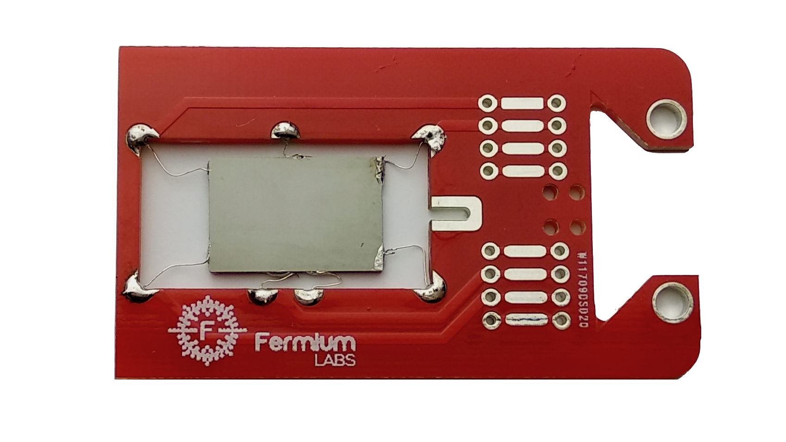

# Experiment Procedure
## The experimental setup

The apparatus uses a Ge sample, cut from a standard P-doped wafer, placed inside a isothermal aluminum case. It is placed in the gap between two poles of a permanent magnet, realized from two Nd-Fe-B magnets and a U shaped soft-steel core, acting like a torus.

The sample has 7 wires tin soldered in the positions shown in Fig. \@ref(fig:sample-circuitry) and Fig. \@ref(fig:sample-pcb)  as follows:
```{r 'sample-circuitry', out.width='65%',fig.cap='Simplified schematic of the sample circuitry',echo=FALSE,fig.align = 'center'}
knitr::include_graphics('Assets/Figures/sample_circuitry.png')
```


*   Contacts 1 and 4 are used to feed the bias current Ib produced by a programmable constant current generator (Fig. \@ref(fig:sample-circuitry)).
*   Contacts 7 and 5 are used to measure (through a differential amplifier, DA for short) the voltage across the sample, in a 4-wire (often called "Kelvin") resistance measurement. 
*   Contacts 2-3 and 6 are the output of the Hall voltage and fed to two DA. 

    Contact 6 is the reference point for the  Hall voltage and contacts 2 and 3 are used to set the balancing potentiometers P after having removed the sample from the magnetic field (the Hall voltage should be zero in absence of applied magnetic field). The potentiometers P are not directly connected to the sample as it would lower the impedance of the mesurement.
    *Three contacts* are needed for the Hall voltage because *two contacts* cannot be precisely aligned.
   
```{r sample-pcb, out.width='65%',fig.cap='Printed circuit board with germanium sample',echo=FALSE,fig.align = 'center'}

```    


The DA outputs are fed to a ADC (Analog to Digital Converter) with an embedded PGA (programmable gain amplifier) that can be controlled trough the computer.
The DA input circuitry is floating with a maximun $\pm12V$ input range referred to ground (of the DB25 connector) and is then referenced to $2.5V$.

The numbering of the contact on the sample corresponds to the number of the pins in the rj45 connector of the sample assembly.

The output voltages measured can be distorted in a number of cases:

*   If the output of the DA is not $0 < V_{out} < 5.1$ it is clamped down by a Schottky diode to prevent damage to the circuitry
*   If the output voltage of a PGA is not $0 < V_{out} < 5$ the ADC will saturate
* 	If the $I_b$  current is set to a value too high the hall voltage may saturate the circuitry. This can change depending on the position of the sample inside the magnetic field. 

The best value for the bias current is a compromise between the need to obtain a large $V_H$ to make measurements precise reducing the SNR (Signal to Noise Ratio) and a low self-heating of the element due to the Joule effect: $V_R$ and $V_H$ signal are proportional to $I$ while the Joule self-heating is $P=RI^2$. A value of $20mA$ is a good starting point.
