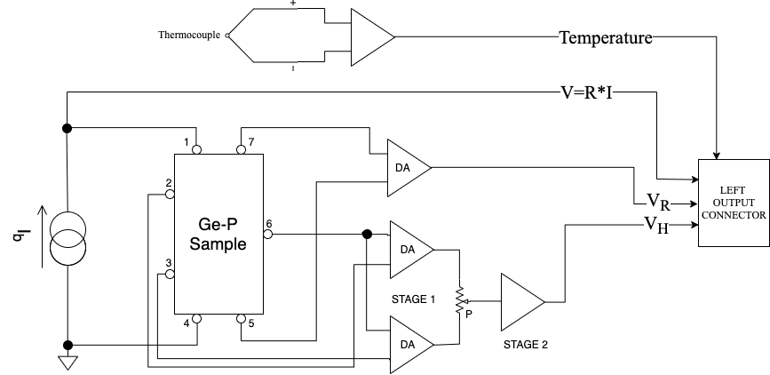

---
output:
  pdf_document: default
  html_document: default
---
# Experiment Procedure
## The experimental setup

The apparatus uses a Ge sample, cut from a P-doped ingot, placed inside a isothermal aluminum case. It may be positioned in the gap between the two poles of a permanent magnet, made of two Nd-Fe-B discs and a U shaped soft-steel core, acting like a torus.

The sample has 7 wires soldered in the positions shown in Fig. \@ref(fig:sample-circuitry) and Fig. \@ref(fig:sample-pcb)  as follows:
```{r 'sample-circuitry', out.width='65%',fig.cap='Simplified schematic of the sample circuitry',echo=FALSE,fig.align = 'center'}

```


*   Contacts 1 and 4 are used to feed the bias current from 0 to 20mA $I_b$ produced by high-stability constant current generator (Fig. \@ref(fig:sample-circuitry)).
*   Contacts 7 and 5 are used to measure (through the use of differential amplifiers, DA for short) the voltage across the sample, in a 4-wire (often called "Kelvin") resistance measurement. 
*   Contacts 2-3 and 6 are the output of the Hall voltage and fed to two DA. 

    Contact 6 is the reference point for the  Hall voltage and contacts 2 and 3 are used to set the balancing potentiometers P after having removed the sample from the magnetic field (the Hall voltage should be zero in absence of applied magnetic field). The potentiometer P is not directly connected to the sample as it would lower the impedance, thus affecting the measurement.
    
    *Three contacts* are needed for the Hall voltage because *two contacts* cannot be precisely aligned.
    
    This measurement method is often called "5 wire hall voltage measurement" and is to date the most accurate way to conduct this experiment.
   
```{r sample-pcb, out.width='65%',fig.cap='Printed circuit board with germanium sample',echo=FALSE,fig.align = 'center'}
knitr::include_graphics('Assets/Figures/sample_pcb.png')
```    


The differential amplifiers DA gain can be varied from a value of 0 (disabled) to 4096 in increments by the power of two. $G_{DA}=[0,1,2,4,8,16,32,64,128,256,512,1024,2048, 4096]$. For the Hall voltage, the gain of the first stage of the amplification circuit can be varied indipendently from the second stage, to allow an easy adjustment of the balancing potentiometer.

The gain of the two stages of the Hall voltage must of course be multipled together.

The DA input circuitry is floating with a maximun $+5V$ input range referred to ground and is then referenced to a $2.5V$ middle point.

The numbering of the contact on the sample corresponds to the number of the pins in the rj45 connector of the sample assembly.

The output voltages measured can be distorted in case of DA saturation, and setting the gains conservately is recommended for a successful experiment run.

The best value for the bias current is a compromise between the need to obtain a large $V_H$ to make measurements precise reducing the SNR (Signal to Noise Ratio) and a low self-heating of the element due to the Joule effect: $V_R$ and $V_H$ signal are proportional to $I$ while the Joule self-heating is $P=RI^2$. A value of $10mA$ is an excellent starting point.
$V_R = I*10 \Omega * 25$

Additionally, a lock-in input is provided. When a $5V$ voltage is present on this input, the bias current will be set to $0mA$. This is not required during normal operation but can be used for especially difficult measurements such as finding earth magnetic north pole using the sample. The input is compliant with standard 5V TTL voltage level.

The instrument outputs are conveniently provided over two DE-15 connectors that can be equipped either with BNC cables or with custom cables. The left connector is used for standard operation, the right connector for advanced operation and diagnostics.


```{r outputConnectionTable,echo=F}

knitr::kable(
  data.frame(
    'Connector'=c('$Left$','$Left$','$Left$','$Left$','$Left$','$Right$','$Right$','$Right$','$Right$','$Right$'),
    Cable=c('Red', 'Green', 'Blue', 'White/Grey', 'Black', 'Red', 'Green', 'Blue', 'White/Grey', 'Black'),
    Description=c('Hall Voltage, $G=G_{STAGE 1}* G_{STAGE 2}$ , $V_{offset}=2.5V$',
                  'Voltage between contacts 5 and 7, amplified, $V_{offset}=2.5V$',
                  'Amplified thermocouple voltage, see chapter on the temperature measurement',
                  'Bias current, voltage output, $V_I = I*10 \\Omega * 25$,  $0V=0mA, 5V=20mA$.',
                  'Gaussmeter output, aplified, $V_{offset}=2.5V$',
                  '2.5V offset, can be used to correct for errors',
                  'Voltage between contacts 2 and 6, amplified by stage 1 of Vh',
                  'Voltage between contacts 3 and 6, amplified by stage 1 of Vh',
                  'Lock-in input. A 5V signal sets bias current to 0mA. Max 100Hz square wave.',
                  '5V output, 100mA max')
    ),
  booktabs = TRUE,
  escape = FALSE,
  caption = 'Output cable pinout'
)


```


