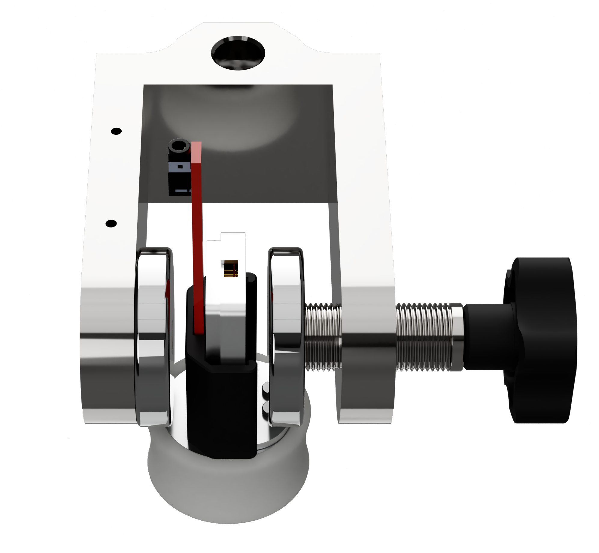

## Hall voltage and resistance measurements at room temperature

With a finite value of magnetic field B orthogonal to the large face of the sample, we should measure identical values for $V_H$ (but with opposite sign) when rotating of $180\,^{\circ}$ the sample.
This behavior must be tested before proceeding to further measurements: if reversing the $B$ direction (i.e. rotating the sample of $180\,^{\circ}$ degrees) different values are measured, the offsets should be better adjusted using potentiometers P in Fig. \@ref(fig:sample-circuitry). If adjusting the offset does not lead to an improvement, there might be a saturated DA in the amplifier circuit: reduce the gain and repeat the test.

The absolute value of $B$ may be varied by changing the width of the gap between the magnetic poles (see Fig. \@ref(fig:ScrewDevice)).
One of the two permanent-magnets mounted on the soft-steel structure may be moved horizontally by turning the screw: increasing the gap, while keeping the sample in the middle between the two magnets, decreases the value of $B$.

```{r ScrewDevice, out.width='65%',fig.cap='The screw device for changing the effective magnetic field',echo=FALSE,fig.align = 'center'}

```


A calibration of the magnetic field $B$ as a function of the gap $d$ may be made using a gauss-meter probe placed between the poles inside the positioning jig. (see Fig. \@ref(fig:BvsGapD))

The ltk-hall-ge apparatus is provided with an included gauss-meter probe with excellent linearity.
