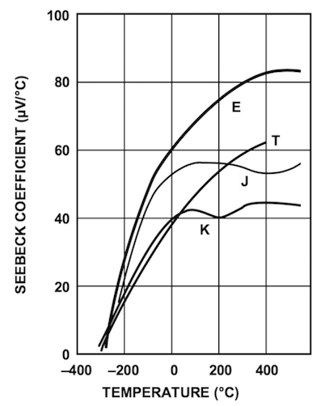

---
output:
  pdf_document: default
  html_document: default
---

## The set-up for changing and measuring the sample temperature


The stainless-steel dewar can be filled of liquid nitrogen or a mixture of acetone and dry-ice (solid carbon dioxyde). The cold finger (the aluminum bar screwed into the base of the sample) is surrounded by the liquid nitrogen, allowing the sample to be cooled.

```{r seebeckNonlinearity, fig.cap='The slope (the Seebeck coefficient) of the thermocouple output signal strongly depend on temperature (not linear).',echo=FALSE,fig.align = 'center', warning=FALSE, message=FALSE}
#

library(here)
library(tidyverse)
library(ggplot2)
library(gridExtra)
library(readr)
library(ggthemes)


setwd(here())


# Import all the tables
nisttable.b <- read_csv(here("analysis/thermocouples/type_b_manclean.csv"),col_names = FALSE, col_types = cols(X1 = col_double(), X2 = col_double()))
nisttable.e <- read_csv(here("analysis/thermocouples/type_e_manclean.csv"),col_names = FALSE, col_types = cols(X1 = col_double(), X2 = col_double()))
nisttable.j <- read_csv(here("analysis/thermocouples/type_j_manclean.csv"),col_names = FALSE, col_types = cols(X1 = col_double(), X2 = col_double()))
nisttable.k <- read_csv(here("analysis/thermocouples/type_k_manclean.csv"),col_names = FALSE, col_types = cols(X1 = col_double(), X2 = col_double()))
nisttable.n <- read_csv(here("analysis/thermocouples/type_n_manclean.csv"),col_names = FALSE, col_types = cols(X1 = col_double(), X2 = col_double()))
nisttable.r <- read_csv(here("analysis/thermocouples/type_r_manclean.csv"),col_names = FALSE, col_types = cols(X1 = col_double(), X2 = col_double()))
nisttable.s <- read_csv(here("analysis/thermocouples/type_s_manclean.csv"),col_names = FALSE, col_types = cols(X1 = col_double(), X2 = col_double()))
nisttable.t <- read_csv(here("analysis/thermocouples/type_t_manclean.csv"),col_names = FALSE, col_types = cols(X1 = col_double(), X2 = col_double()))


# Convert from V to mV
nisttable.b$X2<-nisttable.b$X2*1000
nisttable.e$X2<-nisttable.e$X2*1000
nisttable.j$X2<-nisttable.j$X2*1000
nisttable.k$X2<-nisttable.k$X2*1000
nisttable.n$X2<-nisttable.n$X2*1000
nisttable.r$X2<-nisttable.r$X2*1000
nisttable.s$X2<-nisttable.s$X2*1000
nisttable.t$X2<-nisttable.t$X2*1000

# Clean up data
nisttable.b <- na.omit(nisttable.b)
nisttable.e <- na.omit(nisttable.e)
nisttable.j <- na.omit(nisttable.j)
nisttable.k <- na.omit(nisttable.k)
nisttable.n <- na.omit(nisttable.n)
nisttable.r <- na.omit(nisttable.r)
nisttable.s <- na.omit(nisttable.s)
nisttable.t <- na.omit(nisttable.t)


# WIP, calculate the seebeck coefficient using a derivative
# nisttable.model.b <- smooth.spline(x = nisttable.b$X1, y = nisttable.b$X2)
# nisttable.deriv.b <- data.frame(predict(nisttable.model.b, x = nisttable.b$X1, deriv = 1)) 
# 
# nisttable.model.e <- smooth.spline(x = nisttable.e$X1, y = nisttable.e$X2)
# nisttable.deriv.e <- data.frame(predict(nisttable.model.e, x = nisttable.e$X1, deriv = 1)) 
# 
# nisttable.model.j <- smooth.spline(x = nisttable.j$X1, y = nisttable.j$X2)
# nisttable.deriv.j <- data.frame(predict(nisttable.model.j, x = nisttable.j$X1, deriv = 1)) 
# 
# nisttable.model.k <- smooth.spline(x = nisttable.k$X1, y = nisttable.k$X2)
# nisttable.deriv.k <- data.frame(predict(nisttable.model.k, x = nisttable.k$X1, deriv = 1)) 
# 
# nisttable.model.n <- smooth.spline(x = nisttable.n$X1, y = nisttable.n$X2)
# nisttable.deriv.n <- data.frame(predict(nisttable.model.n, x = nisttable.n$X1, deriv = 1)) 
# 
# nisttable.model.r <- smooth.spline(x = nisttable.r$X1, y = nisttable.r$X2)
# nisttable.deriv.r <- data.frame(predict(nisttable.model.r, x = nisttable.r$X1, deriv = 1)) 
# 
# nisttable.model.s <- smooth.spline(x = nisttable.s$X1, y = nisttable.s$X2)
# nisttable.deriv.s <- data.frame(predict(nisttable.model.s, x = nisttable.s$X1, deriv = 1)) 
# 
# nisttable.model.t <- smooth.spline(x = nisttable.t$X1, y = nisttable.t$X2)
# nisttable.deriv.t <- data.frame(predict(nisttable.model.t, x = nisttable.t$X1, deriv = 1)) 


ggplot() + 
  geom_line(data = nisttable.b, aes(x = X1, y = X2, colour="Type B")) + 
  geom_line(data = nisttable.e, aes(x = X1, y = X2, colour="Type e")) + 
  geom_line(data = nisttable.j, aes(x = X1, y = X2, colour="Type J")) + 
  geom_line(data = nisttable.k, aes(x = X1, y = X2, colour="Type K")) + 
  geom_line(data = nisttable.n, aes(x = X1, y = X2, colour="Type N")) + 
  geom_line(data = nisttable.r, aes(x = X1, y = X2, colour="Type R")) + 
  geom_line(data = nisttable.s, aes(x = X1, y = X2, colour="Type S")) + 
  geom_line(data = nisttable.t, aes(x = X1, y = X2, colour="Type T")) + 
  xlab('Temperature (Celsius)') +
  ylab('Voltage (mV)') +
  labs(color='Thermocouple') + 
  scale_x_continuous(limits = c(-150, 150)) +
  scale_y_continuous(limits = c(-10, 10)) + 
  theme_tufte()


```
-->
Warning: Care must be taken to avoid contact between the dewar black plastic (ABS) and the Acetone. The white plastic (PTFE) is acetone-resistant.

The temperature is measured by a type K (Chromel-Alumel) thermocouple thermally coupled to the sample. The small voltage generated by the thermocouple is amplified by an AD8495[^AD8495] integrated circuit. The output is roughly proportional to the temperature with a sensitivity of $\approx 5\frac { mV }{ \,^{\circ}\mathrm{K} }$ is shifted to obtain $V_{out \, T}=2.5V$ at $273.15\,^{\circ}\mathrm{K}=0\,^{\circ}\mathrm{C}$. While the K type thermocouple is fairly linear in a small range near room temperature, it is not linear in the whole temperature range covered by the apparatus, as can be seen in Fig. \@ref(fig:seebeckNonlinearity).

[^AD8495]: [AD8495 datasheet, Analog Semiconductors](http://www.analog.com/en/products/amplifiers/specialty-amplifiers/thermocouple-interface-amplifiers/AD8495.html)


In order to get a correct measurement it is necessary to compensate for the non-linearity (see Fig. \@ref(fig:seebeckNonlinearity)) of the thermocouple using the following polynomial:

\begin{equation}
  t_{calc}=d_{ 0 }+d_{ 1 }E+d_{ 2 }E^{ 2 }+...+d_{ n }E^{ n }
  (\#eq:compensatingPolynomial)
\end{equation}

where $E$ is the output voltage of the thermocouple in $mV$.

A fitting polynomial \@ref(eq:compensatingPolynomial) of the fifth order is sufficient, given the precision of our equipment.

The table \@ref(tab:kcoefftable) shows the polynomial coefficients obtained from a best fit of the NIST[^srdata] data tables.


```{r kcoefftable,echo=F}

# We're interested in +-200 Celsius temperature range
nisttable.k.interval <- filter(nisttable.k, X1 < 200 , X1 > -200 )


# Fit a polinomial from a linear model
fit <- lm( nisttable.k.interval$X1~poly(nisttable.k.interval$X2,5, raw = TRUE) )

knitr::kable(
  data.frame(
    Coefficient=c('$d_0$','$d_1$','$d_2$','$d_3$','$d_4$','$d_5$'),
    Value=c(fit[["coefficients"]][[1]],fit[["coefficients"]][[2]],fit[["coefficients"]][[3]],fit[["coefficients"]][[4]],fit[["coefficients"]][[5]], fit[["coefficients"]][[6]])
    ),
  booktabs = TRUE,
  escape = FALSE,
  caption = 'Polynomial coefficients obtained from NIST K thermocouple tables ($-200< t \\, [^{\\circ}\\mathrm{C}] <200$).'
)


```


[^srdata]: NIST t-90 tables for K type thermocouples, http://srdata.nist.gov/its90/download/type_k.tab

Fig. \@ref(fig:NISTfit) shows the NIST $t(E)$ data for K thermocouple compared with the results obtained using eq. 24 and the coefficient of table 1, and the residual errors in the range ($-200< t \, [^{\circ}\mathrm{C}] <200$)

```{r NISTfit, out.width='65%',fig.cap='Residual errors of the polynomial fit',echo=FALSE,fig.align = 'center'}
#

#TODO: add celsius degree symbol

plot(fit[["residuals"]], xlab = "Temperature", ylab = "Residual error")

```


The voltage $E$ at the thermocouple junction can be obtained[^AD8495nist] from the following equation:

\begin{equation}
  E=\frac {  V_{ outT }-{ V }_{ Ref }-{ V }_{ Offset } }{ Gain } 
  (\#eq:voltageAtThermocoupleJunction)
\end{equation}


where $V_{outT}$ is the output of the instrument (on the front panel), $V_{Ref}=2.5V$ the voltage that indicates a temperature $T=0\,^{\circ}\mathrm{C}$, $V_{offset}$ is the error voltage at $0\,^{\circ}\mathrm{C}$ to achieve 125 mV at $25\,^{\circ}\mathrm{C}$ and $Gain$ is the internal gain of the AD8495 amplifier.

Using the fitting polynomial  \@ref(eq:compensatingPolynomial) allows us to finally obtain the temperature in Celsius:

\begin{equation}
  t={ f }_{ comp }\left( E \right)
  (\#eq:FcompE)
\end{equation}

\begin{equation}
  t={ f }_{ comp } \left( \frac { 1 }{ 2 } \frac { V_{ out }-2.5-1.25\cdot 10^{ -3 } }{ 122.4 } \right)
  (\#eq:ad8494Compensated)
\end{equation}

[^AD8495nist]: [AN-1087, Analog Semiconductors](http://www.analog.com/Assets/Figures/en/technical-documentation/application-notes/AN-1087.PDF)


Two electronically  controlled resistive elements (heaters) are wound around the base of the sample, allowing to heath it up after reaching room temperature. Ltk-hall-ge automatically shuts down the heater if $t \ge 150\, \,^{\circ}\mathrm{C}$ as a safety measure.
