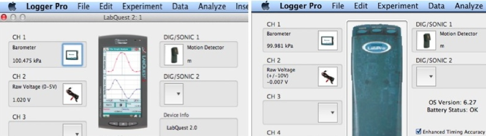
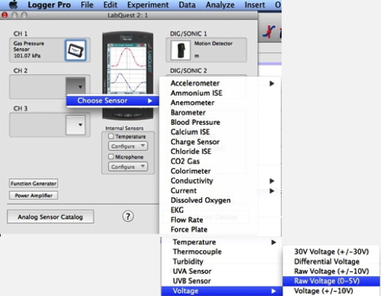
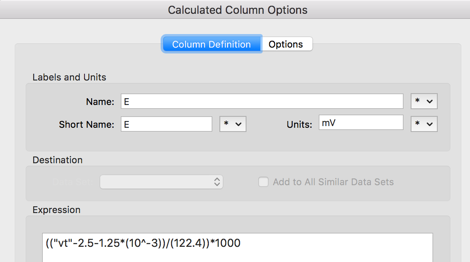
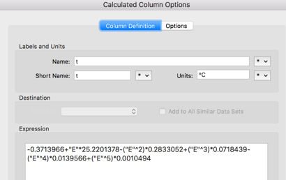
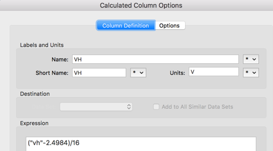
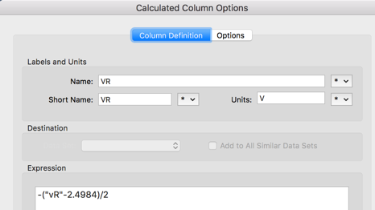
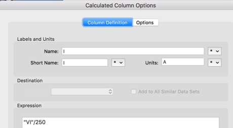
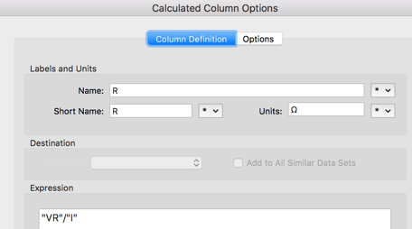

\clearpage 


## Suggested experimental procedure 

### Standard experiment run

To obtain accurate measurements the best procedure is the following:


1. Connect the left output connector to your datalogger
1. Verify the grounding of the equipment. The equipment should be connected to ground through the dedicated grounding plug. 
    * WARNING: In case the ground is not properly connected, interferance may be coupled causing the apparatus to misbehave. 
1. Place the sample in the middle of the gap. Choose a proper value for the current $I_b$ within a suggested 5-15mA range
1. Optionally, adjust the gains for $V_H$ (firstly, leave the second stage at $G=1$ and adjust the first stage, then adjust the second stage), for $V_R$ and for $I_B$. 
    * Note : the resistance at higher temperature may exceed the value at room temperature by a factor 2, and also the $V_H$ signal increases with temperature. To avoid saturation it is recommended the the output voltage stays between $1V<V_{out}<4V$.
1. Check that the $V_H$ value changes sign when rotating the sample of 180° around vertical axis. Choose the orientation that gives positive $V_H$.
1. Fill about half of the dewar with liquid nitrogen and wait until the liquid surface is quiet.
1. Insert the cold finger into the dewar (the PTFE dewar-cover should seat stable onto the dewar mouth, and the PTFE heater cover should be set with the hole hosting the pin protruding from the dewar-cover). Adjust the sample in the mid of the magnet-gap and start the data acquisition.
1. Verify your datalogger setup (see datalogger chapter) and start data acquisition.
1. When the plot temperature vs time shows a slope close to zero, pause the data acquisition.
1. Empty the dewar (e.g. transferring the residual liquid nitrogen into another dewar), reposition the sample in the middle of the magnets-gap.
1. Resume data acquisition: the temperature will start increasing.
1. When the temperature vs. time slope start approaching zero, switch ON the heater to half-power. Once the lights start flashing the apparatus will have reached 60°C, do not touch the sample in order to avoid burns.

To obtain precise measurements, at least one and a half hour is required for the whole temperature sweep. 

Note: it is not suggested to keep liquid nitrogen inside the dewar while heating-up the sample: the temperature would rise more slowly and more humidity would condense onto the outer surface of the aluminum probe envelope. 

It is also useful to blow-off the frost in order to prevent water entering the probe envelope (this might affect the thermocouple's weak signal).

Typically one hour is required to complete the full temperature span, and the recommended data acquisition rate is $0.2 sample/s$

### VH Center balance trimming

In case the $V_h$ presents an undesided offset while no magnetic field is present, it is recommended to perform the following trimming procedure

1. Set bias current to $I=15mA$
1. Set the gain of the second stage of $V_h$ to 0, take note of the voltage, it should be $V_h\simeq2.5V$
1. Set the gain of the second stage of $V_h$ to 1. 
1. Place the sample far from the magnetic field and trim the center balance potentiometer (using the provided isolated screwdriver) until you get the previously measured $V_h\simeq2.5V$.
  1. You may set the gain of the second stage of $V_h$ to a value greater than 1 if your equipment is not sensitive enough.
  1. In case the Vh gain is still incorrect, you may use the left and right potentiometers to adjust beyond the capabilities of the center potentiometer.

## Data acquisition setup with Vernier software

The following chapter will explain the usage of the LoggerPro or LoggerLite software for Labpro/LabQuest2 Dataloggers in conjunction with ltk-hall-ge.
LabPro, LoggerPro, LoggerLite, Labquest, Labquest2 are products and trademarks of Vernier.

### Standard experiment run

In order to acquire the data correctly, you may execute the following procedure when indicated:

1. Connect the 4 cables to the 4 Analog Inputs of the DataLogger (LabPro or LabQuest2) as follows: red cable ($V_h$) to CH1, blue cable ($V_T$) to CH2, green cable ($V_R$) to CH3, gray cable ($V_I$) to CH4.
1. Connect the DataLogger to the PC (and connect the power supply to AC main). 
1. Start the LoggerPro application on the PC. 
1. The 4 signals of the Ltk-Hall-Ge device must be configured as standard “Raw Voltage 0-5V” sensors (see figure \@ref(fig:loggerpro1) and \@ref(fig:loggerpro2)). Depending on the type of DataLogger in use you may notice different windows. In both cases you can click onto the field of the selected channel and a pop-down list will appear (see fig. \@ref(fig:loggerpro2)), where you should choose the Raw voltage (0-5V) sensor.  
1. Before starting the experiment you may build new columns for the data collection spreadsheet that will be filled with data calculated from the set of the measured raw-data : Hall voltage, Temperature, Magnetic field, Current, Resistance must be calculated from the raw data values as explained hereafter. 
    * For example the temperature $t$ may be calculated from the raw data generated by the thermocouple circuitry in two steps as follows: first we calculate the junction-efm (E) \@ref(fig:loggerpro31), then from the E values we calculate the temperature in Celsius as shown in figure \@ref(fig:loggerpro32).
1. Select the proper values of the gain for the variious channels. These gain values must be used to calculate the actual values from the raw data (taking not of compensating for the 2.5V level shift introduced by the apparatus).
    * Eg. with $V_h$ channel gain $G_{V_h}=16$ and $V_R$ channel gain $G_{V_r}=2$ the column can be calcolated as shown in figures \@ref(fig:loggerpro41) and \@ref(fig:loggerpro42)
    * Eg. With the bias current signal, knowing that the gain for this channel is fixed to $G_{I}=25$ and that the "current sensor" is a resistor of value $R=10\Omega\pm0.1%$ in series to the sample, the actual current (measured in A) should be calculated as shown in figure  \@ref(fig:loggerpro51). Finally, the resistance may be calculated as ratio $R=\frac{V}{I}$ as shown in figure \@ref(fig:loggerpro52)
1. Configure the data acquisition mode as "Time based data collection".

Both during the experiment run and at completion, graphs may be created from the measured data.


```{r loggerpro1,fig.cap='Setting-up sensors with LabQuest (left) and LabPro',echo=FALSE,fig.align = 'center'}

```
```{r loggerpro2,fig.cap='Choosing Raw Voltage sensor',echo=FALSE,fig.align = 'center'}

```
```{r loggerpro31,fig.cap='Calculation of $E$ from the thermocouple voltage',echo=FALSE,fig.align = 'center'}

```
```{r loggerpro32,fig.cap='Calculation of $t$ with polynomial fit',echo=FALSE,fig.align = 'center'}

```
```{r loggerpro41,fig.cap='Calculation of $V_rsh$ with an example gain $G=16$',echo=FALSE,fig.align = 'center'}

```
```{r loggerpro42,fig.cap='Calculation of $V_R$ with an example gain $G=2$',echo=FALSE,fig.align = 'center'}

```
```{r loggerpro51,fig.cap='Calculation of $I$',echo=FALSE,fig.align = 'center'}

```
```{r loggerpro52,fig.cap='Calculation of $R$',echo=FALSE,fig.align = 'center'}

```

### Calibration of the magnetic field 

To perform a complete calibration of the magnetic field $B$ versus the gap between the magnets you may use the mode "Events with Entry". After starting such acquisition mode, you will be able to get the measurements from the gaussmeter probe automatically, as well as manually entering the gap between the magnets when prompted.

### Additional resources

Additional resources on Vernier's software and hardware products may be found on the [manufacturer website](https://www.vernier.com).
A [quick reference manual](http://www2.vernier.com/manuals/LP3QuickRefManual.pdf) is also available, together with a great number of [screencasts](https://www.vernier.com/products/software/lp/).


