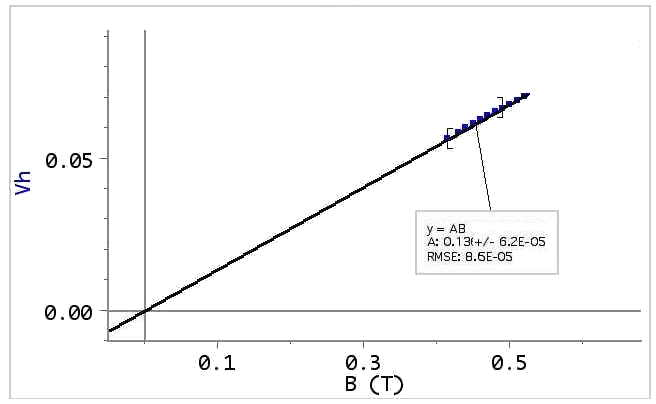

## Typical results

The sample shown in figure 3 (and used to obtain the data  in the following examples)  has thickness $t=0.5mm$, width $w=10mm$ and lenght $l=15mm$.

A calibration of the magnetic field intensity $B$ vs. gap $d$ between magnets is shown in Fig. \@ref(fig:BvsGapD). 

```{r BvsGapD, out.width='65%',fig.cap='Measured $B$ values vs gap width $d$',echo=FALSE,fig.align = 'center'}
knitr::include_graphics('Assets/Figures/H_vs_d.jpeg')
```


An example of the measured $V_H$ vs. magnetic field $B$ at room temperature is shown in Fig. \@ref(fig:HallvsIb).

```{r HallvsIb, out.width='65%',fig.cap='Hall voltage versus magnetic field intensity $B$',echo=FALSE,fig.align = 'center'}

```


Fig. \@ref(fig:Output-voltages-versus-time) shows an example of the measured values of the 3 output signals vs temperature obtained with a constant bias current. 


```{r Output-voltages-versus-time, out.width='65%',fig.cap='Output values versus time',echo=FALSE,fig.align = 'center'}
#knitr::include_graphics('Assets/Figures/Out_vs_time.jpg')

library(ggplot2)
library(here)
library(gridExtra)
library("ggthemes")


#TODO: if user path
data = read.csv(here('analysis','data','ltk-hall-ge current', 'experiment_1.csv'),header = T)

data<-data[-(1:200),]#rimossi i primi 200 valori per pulizia dei dati
data$time<-(data$time-data$time[1])/1000

Vhvstime.plot<-ggplot()+
               geom_line(data=data,aes(time,-Vh),col="blue")+
               xlab("time (s)")+ylab("Vhall (V)")+
               ggtitle(expression("Vhall vs Time"))+
               theme_tufte()


Rvstime.plot<-ggplot()+
              geom_line(data=data,aes(time,R),col="green")+
              xlab("time (s)")+ylab(expression(paste("R (",Omega,")")))+
              ggtitle("R vs Time")+
              theme_tufte()


Tvstime.plot<-ggplot()+  
              geom_line(data=data,aes(time,temp),col="red")+
              xlab("time (s)")+ylab(expression(paste("Temperature ( degree K )" )))+
              ggtitle("Temperature vs Time") +
              theme_tufte()

grid.arrange(Vhvstime.plot,Rvstime.plot,Tvstime.plot,nrow=3)

```


In order to evaluate the Ge energy gap $E_g$, a plot of $ln(R)$ vs. $1/2kT$ was built, after calculating from the Celsius temperature $Tc$ the absolute temperature $T$ ($k$ is the Boltzmann constant $k = 8.617 \cdot 10^{-5}$.

From the slope in the intrinsic region (high temperature region, see Fig. \@ref(fig:EgFit) ) we get the value of the energy gap $E_g$, extrapolated linearly to $T=0^{\circ}\mathrm{K}$, that can be compared to the known value for germanium ($E_g^o=0.78$, see Appendix 3)


```{r EgFit, out.width='65%',fig.cap='Example of linear best fit in the intrinsic region (high temperature)',echo=FALSE,fig.align = 'center'}
knitr::include_graphics('Assets/Figures/ImageEgFit.jpg')


```