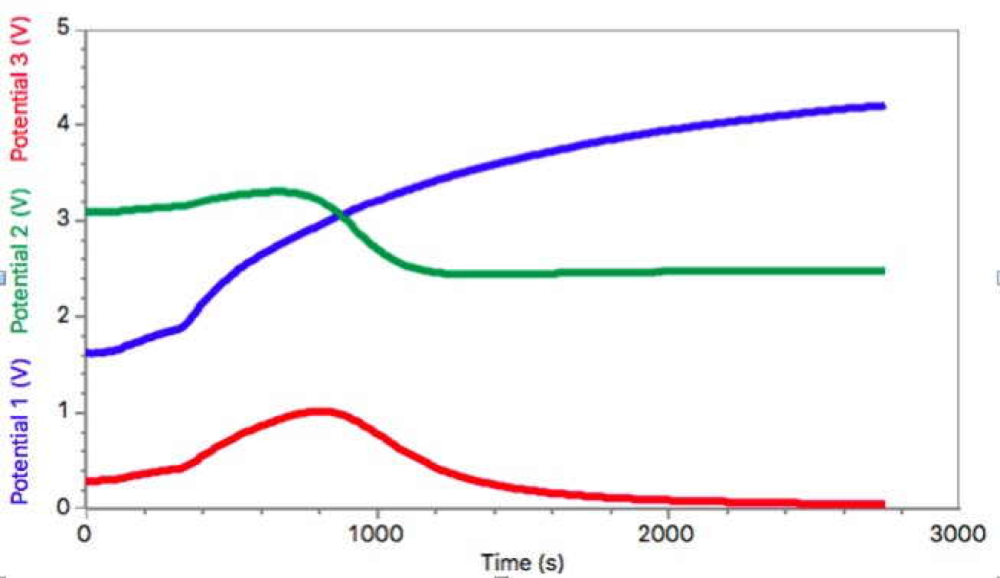
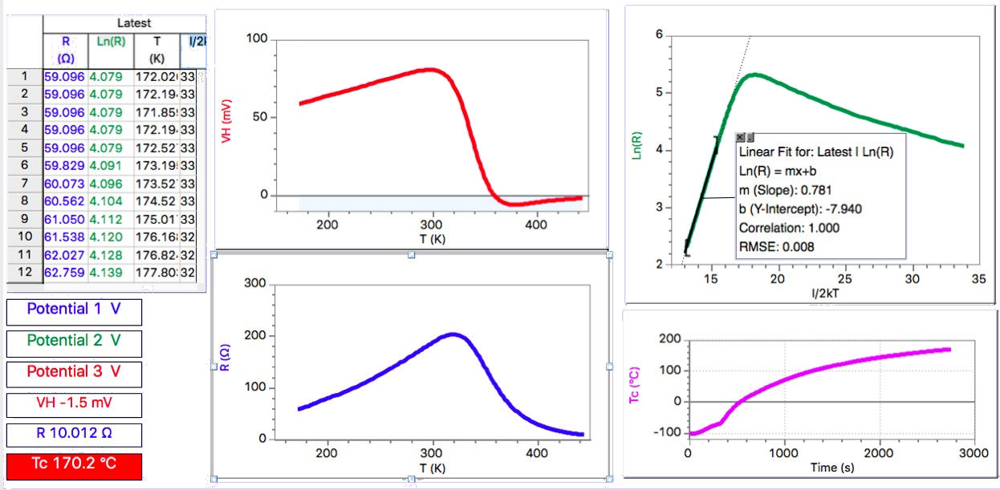

## Typical results

The sample shown in figure 3 (and used to obtain the data  in the following examples)  has thickness $t=0.5mm$, width $w=10mm$ and lenght $l=15mm$.

A calibration of the magnetic field intensity $B$ vs. gap $d$ between magnets is shown in Fig. \@ref(fig:BvsGapD). 

```{r BvsGapD, out.width='65%',fig.cap='Measured $B$ values vs gap width $d$',echo=FALSE,fig.align = 'center'}
knitr::include_graphics('Assets/Figures/H_vs_d.jpeg')
```


An example of the measured $V_H$ vs. magnetic field $B$ at room temperature is shown in Fig. \@ref(fig:HallvsIb).

```{r HallvsIb, out.width='65%',fig.cap='Hall voltage versus magnetic field intensity $B$',echo=FALSE,fig.align = 'center'}
knitr::include_graphics('Assets/Figures/Vh_vs_B.jpeg')
```


Fig. \@ref(fig:Output-voltages-versus-time) shows an example of the measured values of the 3 output signals vs temperature obtained with a constant bias current $I_B=10mA$ and in a 0.4 $T$ magnetic field, using Vernier-LabPro interface. The graph shows *Potential 1*  $= V_{out \, T}$, *Potential 2* $= V_{out \,H}$, *Potential 3* $= V_{out \, R}$. 


```{r Output-voltages-versus-time, out.width='65%',fig.cap='Output voltages versus time',echo=FALSE,fig.align = 'center'}

```


Fig. \@ref(fig:Example)  shows an example of calculated data obtained using LoggerPro software. 
The Hall voltage $V_{H}$ (in mV) is is obtained from $V_{outH}$ by subtracting the offset 2.5 V and by accounting for the used value of the channel-H gain (here GainH=10). The resistance $R$ is calculated from $V_{outR}$ by  accounting for the used value of the channel-R gain (here GainR=0.5)and the measured value of the bias current $Ib$ .

```{r Example, out.width='65%',fig.cap='Example of calculated data',echo=FALSE,fig.align = 'center'}

```


In order to evaluate the Ge energy gap $E_g$, a plot of $ln(R)$ vs. $1/2kT$ was built, after calculating from the Celsius temperature $Tc$ the absolute temperature $T$ ($k$ is the Boltzmann constant $k = 8.617 \cdot 10^{-5}$.

From the slope in the intrinsic region (high temperature region, see Fig. \@ref(fig:EgFit) ) we get the value of the energy gap $E_g$, extrapolated linearly to $T=0^{\circ}\mathrm{K}$, that can be compared to the known value for germanium ($E_g^o=0.78$, see Appendix 3)


```{r EgFit, out.width='65%',fig.cap='Example of linear best fit in the intrinsic region (high temperature)',echo=FALSE,fig.align = 'center'}
knitr::include_graphics('Assets/Figures/ImageEgFit.jpg')
```