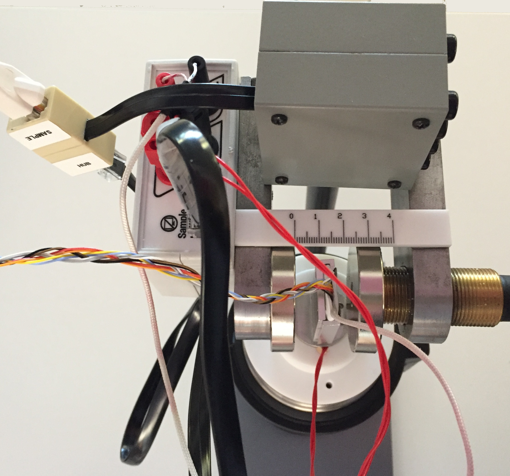

#Appendix 1: Use of the optional Extension HUB

An optional Extension HUB (ExtHUB)is provided with the device. This allows the user to measure the voltages (with respect to the ground or as differential voltages) at the 7 contacts on the Ge sample, by using an high impedance multimeter. 

The ExtHUB must be connected between the sample and the fixed HUB (FixHUB) placed on the magnet holder using the black cable with rj45 plugs. Note: do not unplug the cable from the ExtHUB; the cable should be connected to the FixHUB and the sample cable should be connected to the ExtHUB (see Fig. \@ref(fig:ExtensionHUB)). 


```{r ExtensionHUB, out.width='40%',fig.cap='The Extension HUB connections',echo=FALSE,fig.align = 'center'}

```


  
For example a two-wire resistance measurement between the Test Points (TP) 1-4, 1-5, 7-4 or 7-5 will give a value larger than the real resistance measured by the 4-contacts method, and displayed on the front panel. 

Note: be sure to switch-off the controller while taking measurements with the ExtHUB !
