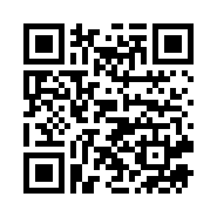

# Warnings

**Using high magnetic field require some caution:**

* You must avoid approaching any magnetizable object (clocks, electronic devices, screwdrivers...), which when brought too close may be permanently magnetized.

* A pinch hazard subsists if steel or other ferromagnetic material gets close to the magnets.

* Do not attempt to unscrew the magnets.

* The Magnets are brittle. A rapid shock with another magnet or ferromagnetic material may release shards dangerous for the eye.

* The apparatus **MUST NOT** be used by people with pacemakers.

# References

* J.C. Slater *Quantum Theory of matter*, mcGraw-Hill 1951.
* C.L.Chin e C.R.Westgate, *The Hall Effect and Its Applications*, Plenum Press, NY, 1979
* J.R.Hook, H.E.Hall *Solid State Physics*, John Wiley &Sons 1991.
* A. C. Melissinos *Experiments in modern Physics*, Academic Press, 1993.
* *New Semiconductor materials. Characteristics and Properties*, 
    \newline http://www.ioffe.ru/SVA/NSM/Semicond/Ge/index.html (Electronic archive)
* *The Semiconductor informations WebSite* (properties of Germanium), 
    \newline http://www.semiconductors.co.uk/propiviv5431.htm

# Authorship
This Handbook was originally written by Giacomo Torzo of [Labtrek](http://labtrek.it)

Integrations by Davide Bortolami and
Statistical analysis by Simone Tosato of [Fermium LABS](http://fermiumlabs.com)

## Revision history
For a complete revision history, check out the [Github repository](https://github.com/fermiumlabs/Hall-effect-apparatus/commits/master).

The last version of this document can be downloaded at [frm.li/hallhandbookmaster](https://frm.li/hallhandbookmaster) or with the following QR code:

