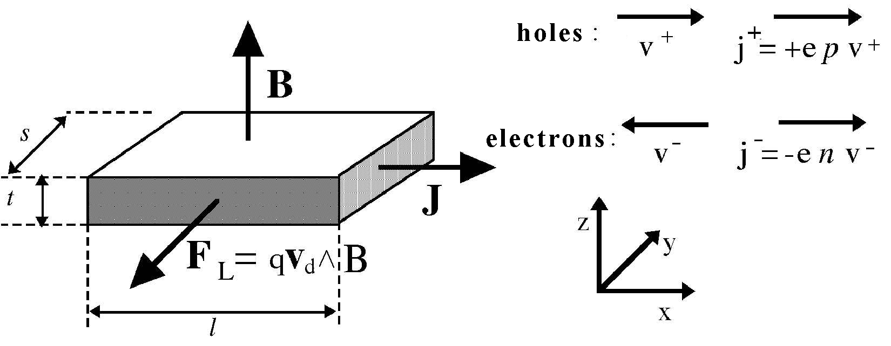
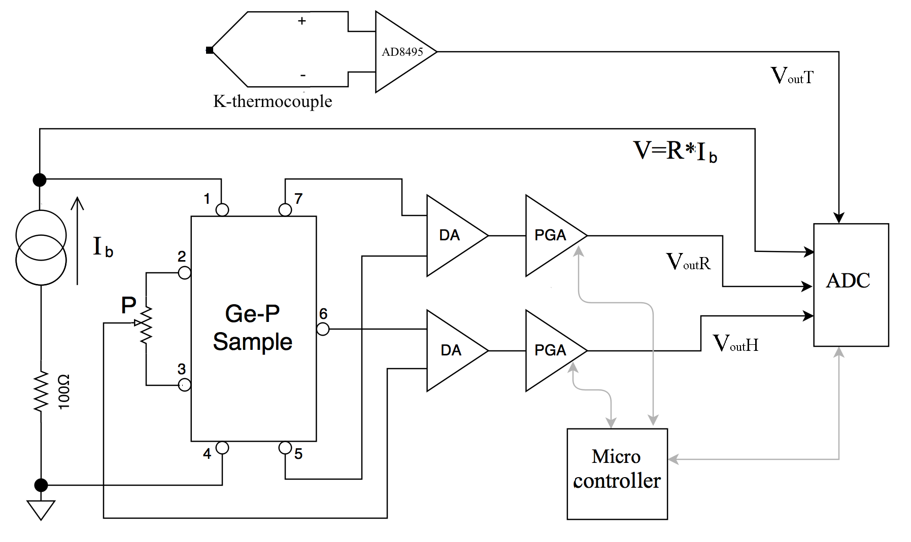
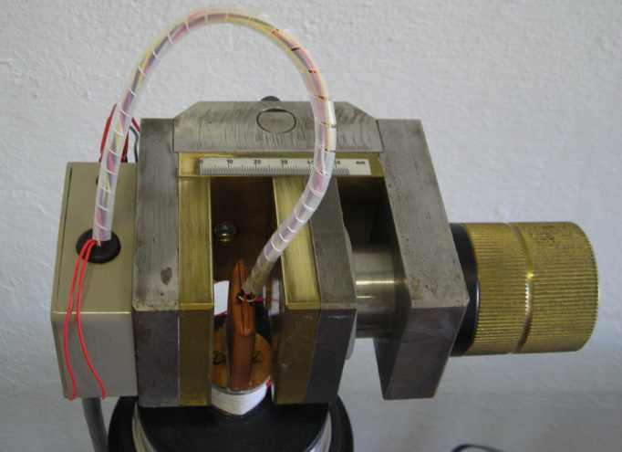
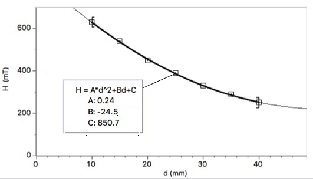
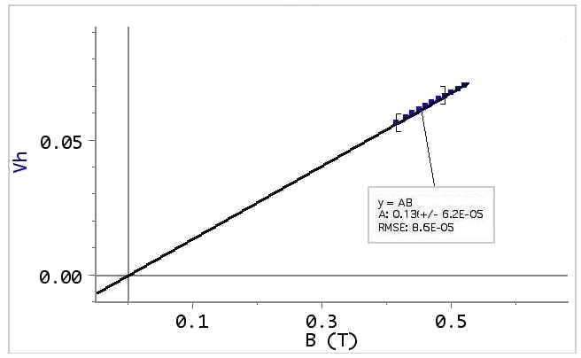
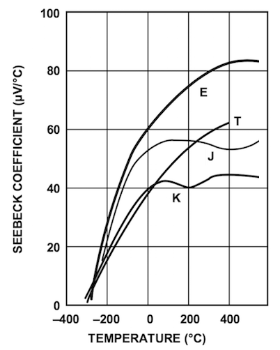

% Hall effect apparatus
% April 2016
<!-- ################################
to compile this document you need pandoc with the pandoc-eqnos filter
http://pandoc.org
https://github.com/tomduck/pandoc-eqnos

Original paper by Giacomo Torzo of LABTREK
Revision and new technical documentation by Davide Bortolami of Fermium LABS

http://labtrek.it
https://fermiumlabs.com

################################ -->

### Introduction

Edwin Herbert Hall discovered the “Hall effect” in 1879 while working on his doctoral thesis in Physics investigating the influence of magnets on the resistance of a coil excited by a current. Hall discovered that a magnetic field would skew equipotential lines in a current-carrying conductor. This effect is observed as a voltage (Hall voltage) perpendicular to the direction of the current in the conductor.

The magnitude of this discovery is even more impressive considering how little was known about electricity in his time. The electron, for instance, was not identified until more than 10 years later.

The “Hall effect” remained a laboratory curiosity until the latter half of the XX century because the materials available, such as metals, would only produce small Hall voltages. With the advent of semiconductor technology and the development of various III-V compounds, it became possible to produce Hall voltages many orders of magnitude greater, allowing the production of Hall sensors, mostly made of indium antimonide (InSb), indium arsenide (InAs) and gallium arsenide (GaAs).

###A macroscopic approach to Ohm’s laws

The usual *macroscopic* approach to electrical conduction is based on the following experimental observations on metallic conductors:

1) The application of a steady voltage difference $V$ to a metallic wire produces a steady electric current $I$ proportional to $V$. This holds true at least for small values of $I$ when the temperature of the wire does not increase appreciably.

    This allows the definition of the *electric resistance* as follows, according to the first Ohm's law:
 $$R=\frac{ V }{ I }$$ {#eq:ohmLaw1}

2) For high currents the wire temperature increases and the power $W=VI$ supplied by the generator to the moving charges, instead of accelerating more and more the circulating charge, is converted into heat (Joule effect).

    It could appear that the moving charges are subjected to some kind of force, like a body falling in a viscous medium, so that they reach a steady motion and give up part of their kinetic energy to the “body” of the wire (i.e. to the crystal lattice).

3) The resistance $R$ increases with increasing temperature.

4) Using wires of different length $l$ and sections $S$ the second Ohm's law determines the resistance:

    $$ R= \frac{ \rho l}{S} $$ {#eq:ohmLaw2}

    Where the constant $\rho$ (the *electrical resistivity*) has a characteristic value for any material and increases with temperature.

The inverse quantity, the *electrical conductivity* $\sigma$, can be expressed using the two Ohm's laws as:

$$\sigma = \frac{1}{ \rho }=\frac{J}{E}$$ {#eq:conductivity}

Where $J$ is the current density and $E$ the electric field intensity. This is the starting relation needed to pass to a *microscopic* picture, that will allow a better understanding of the phenomena.

###A semiclassical microscopic model

The simplest microscopic model one can use is the “free electron gas" model of metals, in which the valence electrons are supposed to be practically free from their original atoms, and thus to move in the crystal lattice formed by the metal ions. In the absence of an applied electric field, the electron velocities are randomly distributed, with zero mean value and a *root mean square* value $v_{m}$ that may be evaluated from the equation:

$$\frac{1}{2}mv_{m}^2=\frac{3}{2}kT$$ {#eq:electronVrms}

where $k$ is the Boltzmann constant, $m$ the electron mass and $T$ the absolute temperature: at room temperature $v_{m}$ turns out to be of the order of $10^5 m/s$.

Only when an electric field is externally applied the electron motion acquires an ordered component with a *mean value* $v_d$ (the *drift velocity*) which turns out to be very small with respect to $v_{m}$ as we will show later.

The drift velocity, i.e. this ordered component of the motion due to the electric field and to the the scattering of the electrons with the lattice, is simply proportional to the electric field intensity. The constant ratio between $v_d$ and $E$ (both in modulus) is called the *drift mobility* $\mu$.

During a time $t$ of free motion between two collisions, the electrons increase their speed of the quantity:
$$ a t = \frac{qE}{m}t $$ {#eq:electronsDelta} <!-- ??? dovrebbe essere in funzione del tempo -->

Where $q$ is electron charge. The kinetic energy of the electrons also increases, but it can be assumed that with each collision they loose additional energy. The transfer of such energy to the lattice ions explains the Joule effect.

In figure 1 it can be noticed[^feynman] that <!--FIX-->, after the application of the electric field, the average speed of the electrons is not zero but instead:
$$v_d=a\tau=q\tau\frac{E}{m}$$ {#eq:electronsAvgSpd}

[^feynman]: See for instance *The Feynman lectures on Physics* vol.I 43-1,3  Addison-Wesley 1963.

Where $\tau$ is the mean free time between collisions[^meanFreeTimeBetweenCollisions], so that the drift mobility $\mu$ has the microscopic expression :

[^meanFreeTimeBetweenCollisions]: This time $\tau$ does not depend on the electric field because the average speed increment due to the applied electric field (*vd*) is very small with respect to the r.m.s. speed *vm* due to thermal motion .

$$ \mu = \frac{v_d}{E} = \frac{q\tau}{m} $$ {#eq:driftmobility}
Using these concepts of drift speed and mobility the current density $J$ can be written as:

$$ J = qn v_d $$ {#eq:currentDensity}

Where $n$ is the free electron concentration and relation ({@eq:conductivity}) and ({@eq:driftmobility}) allow us to give a *microscopic definition* of the electrical conductivity:

$$ \sigma = q n \mu $$ {#eq:electricalConductivity}

Relation ({@eq:electricalConductivity}) tells us that all the physics of electrical conduction is described by the two parameters $n$ and $\mu$.

In the electron gas model $n$ should be, for a monovalent metal:
$$n=\frac{N_Am}{\delta} $$ {#eq:nmonovalentmetal}

Where $N_A$ is Avogadro's number, $m$ is the atomic mass and $\delta$ the density. As an example $n=8.5*10^28m^{-3}$ for copper. <!--maybe add a reference to a cute table somehwere-->
Of course $n$ should not depend on the temperature.

A rough order of magnitude for the electron mobility may be derived using ({@eq:driftmobility}). A reasonable value for $\tau$ is: $\tau\approx\lambda/v_{m}$, where $\lambda$ is the electron mean free path, of the order of the interatomic distance in the metal (i.e. a few $\mathring{A}$) so that, at room temperature, $\tau$ is of the order of $10^{-15}s$.

Using the values of the elementary charge $e = 1.6*10^{-19 }C$ and of the electron mass $910^{-28} g$, the electron mobility $\mu=\frac{e\tau}{m}$ should be of the order of some $\frac{cm^2}{Vs}$.

Even for very large electric fields (up to $10^2 \frac{V}{cm}$) the drift velocity $v_d=\mu E$ is thus much smaller than $v_{m}$.

Drift mobility should decrease with increasing temperature[^drifmobilityAndTemperature] because of the increased thermal vibrations of the lattice ions. This effect can be studied by measuring the dependence of the electrical conductivity on temperature, but only if the free carrier concentration is the same at all temperatures.

[^drifmobilityAndTemperature]: Drift mobility in semiconductors decreases with the absolute temperature $T$ as $T^{-\alpha }$, where $1.5<a<3.0$ depending on the prevailing type of interactions of the free carriers (with phonons, lattice defects, or impurities).

In order to check experimentally the microscopic model we must measure not only the electrical resistance (which gives the product of $n$ and $\mu$) but also the free charge density $n$: this can be obtained by performing a measurement of the Hall effect.

###The Hall effect

The Hall effect is essentially due to the Lorentz force $\vec { F }$ acting on each electric charge $q$ moving with velocity $v$ in a magnetic field $B$.
$$\vec { F } =q\vec { V } \wedge \vec { B }$$ {#eq:lorentzForce}

Let us consider a conducting bar (figure 1) immersed into a uniform magnetic field $B$ directed along the $z$ axis, with an electric current $I_x$ flowing along the $x$ axis. The Lorentz force $F_L$ on moving charges, both positive and negative, acts in the direction shown by the arrow (figure 1) (independently from the charge sign).

\

In metals the electric current is only due to electrons. In semiconductors the charge carriers may be either electrons or holes.

In a pure semiconductor the electron density $n$ and the hole density $p$ is identical, in doped semiconductor we have $n\gg p$ (in N-doped material) or $p\gg n$ (in P-doped material). In doped semiconductors only one type of charge carriers is therefore important.

Let us consider first a metal or a N-doped semiconductor sample, where the relevant charge carriers are electrons.

In the electric field $E_x$ the electrons gain a drift velocity $v_d=–\mu E_x$ and they are subject to the Lorentz force $F_L=qv_dB$, pointing towards the negative $y$. While drifting in the $x$ direction they tend to crowd at the sample surface orthogonal to the $y$ axis and placed towards the reader in figure 1.

This charge density increase at the sample lateral surface produces a difference of potential along the $y$ axis and therefore an electric field $E_H$. The value of the *Hall field* $E_H$ at equilibrium will correspond to an electric force $qE_H$ equal and opposite to the Lorentz force, i.e. $E_H=v_d B$. This relation tells us that the Hall field is proportional both to the current density (through $v_d$) and to the magnetic field. It is therefore convenient to define the Hall coefficient as:

$$ R_H=\frac{E_H}{J_x B_z}$$ {#eq:hallCoefficient}

Recalling the relations $J_x=-env_d$ (or $J_x=+epv_d$) we get :

$$ R_{ H }=V_{ d }\frac { B }{ J_{ x }B } =\frac { -1 }{ en } $$ {#eq:R_Hmn}
or otherwise, for P-doped conductors:
  $$ R_{ H }=\frac { +1 }{ ep }  $$ {#eq:R_Hp}

Depending on the type of conductor, either metal ({@eq:R_Hmn}) , N-doped ({@eq:R_Hmn}) or P-doped ({@eq:R_Hp}).

Measuring $R_H$ we can determine the concentration $n$ of majority carriers and their sign (if we know the direction of the vectors $\vec { B } ,\vec { J } ,\vec { E_{ h } }$ ).

We can obtain relation ({@eq:R_Hmn}) by assuming identical drift velocity for all charge carriers. This is an approximate relation, found in the literature: <!--FIX, source?-->

$$R_H = \frac{r}{nq}$$ {#eq:foundInLiterature}

Where $r$ is a parameter that accounts for the statistical velocity distribution of the charge carriers, as well as the different scattering mechanisms: $r\approx 1.2$ for mainly phonon scattering (lattice vibrations) and $r\approx 1.9$ for mainly impurity scattering. <!--FIX, mainly? sounds strange-->

The Hall coefficient in semiconductors is many order of magnitude larger than the one in metals, due to the smaller charge density. This makes easier to measure Hall voltages in semiconductors, where a bias current $I_x$ of a few $mA$ may conveniently generate a Hall voltage $V_H$ of in the order of a few $mV$.

To measure $R_H$ we must know $V_H$, $I_x$, $B$ and the sample thickness $t$:

$$R_{ H }=\frac { E_{ h } }{ B{ J }_{ x } } =\frac { V_{ H } }{ s } =\frac { B{ I }_{ x } }{ ts } =\frac { V_{ h }t }{ B{ I }_{ x } } $$   {#eq:R_h}

It is worth noting that the the Lorentz force direction does not depend on the charge sign.

The general expression for $R_H$, valid (see Appendix 1) <!-- FIX --> when *both electrons and holes* are present with densities $n$ and $p$ and mobility $\mu_e$ and $\mu_h$ is:

$$R_{ H }=r\frac { p\mu ^{ 2 }_{ h }-n\mu ^{ 2 }_{ e } }{ e(p\mu _{ h }-n\mu _{ e })^{ 2 } } $$ {#eq:R_hGeneralExpression}

Which corresponds to the relations   and ({@eq:R_Hmn}) and ({@eq:R_Hp}) for $p\gg n$ or $n\gg p$

When two types of charge carriers are present the electrical conductivity becomes:

$$\sigma =e(p \mu_h + n \mu_e)$$ {#eq:electricalConductivity2Carriers}

The product $R_H \sigma$, is named Hall mobility $\mu_H$ (note the capital index "$H$" that distinguish it from hole mobility $\mu_h$).

For a doped semiconductor the Hall mobility $\mu_H$ approximates the *majority carriers* drift mobility $\mu_{h,e}$:

$$\mu _{ H }=R_{ H }\sigma =r\frac { p \mu^2_h - n \mu^2_e }{p \mu_h + n \mu_e  } \approx r \mu_{h,e} $$ {#eq:muApproximateDriftMobility}

From relation ({@eq:R_hGeneralExpression}) we see that by increasing the temperature in a *P-doped sample*, generating many intrinsic[^4] carriers (i.e. electron-hole pairs), the Hall coefficient $R_H$ (which is positive at room temperature in the extrinsic region) tends to decrease, and it may even change sign. This is explained by the mobility ratio  $b=\mu_e/\mu_h>1$. *Note that this does not happen with a* N*-doped sample*.

[^4]: *Intrinsic* term labels properties related to pure semiconductors or to doped semiconductors at hight temperature, where the thermally generated carriers density is much larger than the (*extrinsic*) carrier density due to the dopant.

From relation ({@eq:R_hGeneralExpression}) at the temperature where $R_H=0$ (“*inversion point*”) we get $nb^2=p$, with $p=N_a+N$ <!-- if it is avogadro number it should be N_A? --> and $n=N$ (where $N_a$ is the dopant density and $N$ is the thermally-generated charge density in the intrinsic zone).
Therefore $Nb^2= N_a+N$, or $N_a/N=b^2-1$.

The intrinsic conductivity *measured* at the inversion point is:

$$ \sigma_{oi} = e(n \mu_e + p \mu_h ) = e[N( \mu_e + \mu_h)+ N_a \mu_h ] = e \mu_h [N(b+1)+N_a]$$ {#eq:intrinsicConductivityInvPoint}

In the extrinsic region of a P-doped sample, where the charge carrier density is constant $n=N_a$, the conductivity is proportional to the carrier mobility $\mu_h$: i.e. $\sigma_e(T) = eN_a \mu_h(T)$

The experimentally measured temperature dependence of the mobility is a power-law $\mu(T)=const( T^\alpha)$, where the exponent $\alpha$ (in the range $1.5<\alpha<3.0$) depends on the type of prevailing interaction of the charge carriers with phonons, lattice defects or impurities).

Therefore we may *extrapolate the extrinsic conductivity at the inversion point* $\sigma_{ei}$, and from the ratio ${\sigma_{oi}}/{\sigma_{ei}}$ we get the $b$ value:

$$ \frac{\sigma_{oi}}{\sigma_{ei}} =e\mu_h \frac{N(b+1) + N_a}{e N_a \mu_h}= \frac{b}{b-1}$$ {#eq:extrinsicConductivityInvPoint}

Which can as well be written as:

$$b=\frac{R_e}{R_e-R_o}$$ {#eq:extrinsicConductivityInvPoint2}

Where $R_o$ is the measured sample resistance at the inversion point and $R_e$ is the resistance extrapolated from the extrinsic region (low temperature) to the value it would have at the inversion temperature.

The dopant concentration is related to the value of the *Hall constant at the inversion point* $R_{Ho}$ (in the extrinsic region only the hole concentration is significant) by the equations ({@eq:R_Hmn}) and ({@eq:R_Hp}), i.e. :
$$ N_a \approx p \approx \frac{1}{e R_{Ho}}$$ {#eq:HallConstantInvPointRelation}

###The experimental setup

The apparatus uses a Ge sample, cut from a standard P-doped wafer, placed inside a isothermal aluminum case. It is placed in the gap between two poles of a permanent magnet, realized from two neodimium magnets and a U shaped soft-steel core, acting like a torus.

The sample has 7 wires tin soldered in the positions shown in figure [FIX] as follows:

\

*   Contacts 1 and 4 are used to feed the bias current produced by a costant current generator [fix, see figure x]
*   Contacts 7 and 5 are used to measured the voltage across the sample, to obtain a 4-wire (often called kelvin) resistance measure. The input is fed to a differential instrumentation amplifier (DIA for short).
*   Contacts 2-3 and 6 are the output of the Hall voltage and fed to the a second DIA.

The potentiometer P [fix] in figure [fix] is used to adjust the balance of the Hall voltage, since the contacts 2 and 3 cannot be precisely positioned.
It must be adjusted to obtain $V_H=0$ when there is no applied magnetic field. Of course the presumed $V_H \neq 0$ we obtain if we do not adjust correctly P is not due to the magnetic field, but to the resistance of the sample itself.

The two DIAs have a gain $G$, generally set to $0.5$ for $V_r$ and to $100$ for $V_H$, but it can vary according to instrument specifications, and they're powered from a $\pm 15V$ power supply.

A PGA (Programmable Gain Amplifier) is chained to each of the two DIAs, it's gain selectable from the following values $G_{ PGA}= \{ 1,2,5,10,20,50,100,200\}$ using the front panel.

The output voltages on the front panel are restrained by a number of cases:

*   If the input voltage is $V_r > \frac{30}{G}$ or $V_H \gtrless  \pm \frac{15}{G_{DIA}}$  a DIA saturates.
*   If the output of the DIA is not $0 < V_{out} < 5.1$ it is clamped down by a Schottky diode to prevent damage to the circuitry.
*   If the output voltage of a PGA is not $0 < V_{out} < 5$  the PGA saturates

The bias current $I_b$ is measured from the voltage drop across a $100 \Omega$ resistor $R_i$, giving thus an output of $10 \frac{mA}{V}$.

A digital-to-analog (DAC) converter acquires the analog values, sampling them from a $0 < V_{in} < 5$ to a integer value from $0$ to $2^{12}$

The best value for the bias current is a compromise between the need to obtain a large $V_H$ to make measurements precise reducing the SNR (Signal to Noise Ratio) and a low self-heating of the element due to the Joule effect: $V_R$ and $V_H$ signal are proportional to $I$ while the Joule self-heating is $P=RI^2$

###Hall voltage and resistance measurements at room temperature

With a finite value of magnetic field B orthogonal to the large face of the sample, we must measure identical values for $V_H$ (but with opposite sign) when rotating of $180°$ the sample.
This behavior must be tested before proceeding to further measurements: if reversing the $B$ direction (i.e. rotating the sample of $180°$ degrees) different values are measured, the offsets and balancing should be better adjusted.

The absolute value of $B$ may be varied by changing the width of the gap between the magnetic poles (see figure [fix]).
One of the two permanent-magnet  mounted on the soft-steel structure may be moved horizontally by turning the brass-screw: increasing the gap, the value of $B$ decreases.

[fix, update image]

\

A calibration of the magnetic field $B$ as a function of the gap may be made using a gauss-meter probe placed between the poles (see figure [fix]).

The magnetic field $B$ may be calibrated using a gauss-meter probe placed at the center between the poles.

\

Figure [fix] shows the linear dependence of $V_H$ on $I$ and $B$. Deviations from linearity at high values of the magnetic field may be explained by calculating a second order approximation of $R_H$ (Appendix 1)

\

###Measurements at constant $I$ and $B$ while varying the temperature

The stainless-steel dewar can be filled of liquid nitrogen or a mixture of acetone and dry-ice (solid carbon dioxyde). The cold finger (the aluminium bar screwed into the base of the sample) is surrounded by the liquid nitrogen, allowing the sample to be brought lo low temperatures.

The temperature is measured by a tipe K (Chromel-Alumel) thermocouple thermally coupled to the sample. The small voltage generated by the thermocouple is amplified by the AD8495 integrated circuit. The output is  proportional to the temperature, with a sensitivity of $\approx 10\frac { mV }{ °C }$.

In order to get a correct measurement it is necessary to compensate for the non-linearity (see figure [fix]) of the thermocouple linearly extrapolating the following polynomial[^kpoly] :

\

[^kpoly]:   Burns, G. W.; Scroger, M. G.; Strouse, G. F.; Croarkin, M. C.; Guthrie, W. F. Temperature-Electromotive Force Reference Functions and Tables for the Letter-Designated Thermocouple Types Based on the ITS-90. NIST Monograph 175; 1993. 630 p.

$$t=d_{ 0 }+d_{ 1 }E+d_{ 2 }E^{ 2 }+...+d_{ n }E^{ n }$$ {#eq:compensatingPolynomial}
where $E$ is the output voltage of the thermocouple.

In the following table[^srdata] two different groups of coefficients are given, depending on the temperature range:

[^srdata]: NIST t-90 tables for K type thermocouples, http://srdata.nist.gov/its90/download/type_k.tab
[^AD8495]: AD8495 datasheet, Analog Semiconductors, page 11 http://www.analog.com/en/products/amplifiers/specialty-amplifiers/thermocouple-interface-amplifiers/AD8495.html

| t range | -200°C to 0°C  | 0°C to 500°C   |
| :------------- | :------------- | :------------- |
| $d_0$ | 0.0000000E+00  | 0.000000E+00   |
| $d_2$ |  2.5173462E+01 | 2.508355E+01   |
| $d_3$ | -1.1662878E+00 | 7.860106E-02   |
| $d_4$ | -1.0833638E+00 | -2.503131E-01  |
| $d_5$ | -8.9773540E-01 | 8.315270E-02   |
| $d_6$ | -3.7342377E-01 | -1.228034E-02  |
| $d_7$ | -8.6632643E-02 |  9.804036E-04  |
| $d_8$ | -1.0450598E-02 | -4.413030E-05  |
| $d_9$ | -5.1920577E-04 | 1.057734E-06   |
| $d_{10}$ |  0.0000000E+00 | -1.052755E-08  |
| **V range** | **-5.891mV to 0mV** | **0mV to 20.644mV** |
<!-- table of thermoelectric compensation coefficients for K type termocouples -->

Linearly extrapolating a polynomial ({@eq:compensatingPolynomial}) of the fifth order is more that sufficient given the precision of our equipment.

[^AD8495nist]: AN-1087, Analog Semiconductors http://www.analog.com/media/en/technical-documentation/application-notes/AN-1087.PDF

The voltage $E$  at the termocouple junction can be obtained from the following equation:
$$E=\frac { \frac { 1 }{ 2 } V_{ out }-{ V }_{ Ref }-{ V }_{ Offset } }{ Gain } $$ {#eq:voltageAtThermocoupleJunction}

Where $V_{out}$ is the output of the instrument (on the front panel), $V_{Ref}=2.5V$ the voltage that indicates a temperature $T=0°C$, $V_{offset}$  is the error voltage at 0°C to achieve 125 mV at 25°C and $Gain$ is the internal gain of the AD8495 amplifier

Consequently, linearly extrapolating with the compensation polynomial allows us to finally obtain the correct temperature:

$$t={ f }_{ comp }\left( E \right)$$ {#eq:FcompE}
$$t={ f }_{ comp }\left( \frac { \frac { 1 }{ 2 } V_{ out }-2.5-1.25\cdot 10^{ -3 } }{ 122.4 }  \right) $$ {#eq:ad8494Compensated}

####Cooling-Heating procedure

To obtain accurate measurement it's suggested to first cool off the sample by placing liquid nitrogen in the dewar until a stable temperature is reached, then manually empty the dewar letting it slowly drift up to room temperature (due to the unavoidable thermal coupling sample-to-ambient).

During the cooling process measurements may be taken, but the rapid cooling generates a large thermal gradient across the apparatus that makes such measurements less reliable.

A resistive element is wound around the base of the sample, allowing to heath it up after reaching room temperature. The resistive element it's controlled in PWM: it's rapidly powered-on and powered-off with a duty cycle that can be selected (in percetange) on the front panel of the instrument.

[fix, image pwn]

This technique allows for a linear temperature sweep.  Starting with a low power allows to better approximate an equilibrium situation, considering it can subsequently be increased if necessary to reach higher temperatures. The instruments automatically shuts down if $t \ge 150°C$.

Measurements can be obtained by feeding the analog outputs [fix, quali?] to a datalogger and setting a suitable acquisition rate (e.g. 1 sample per minute)

To obtain precise measurements, at least one complete hour is required for the whole temperature sweep.

###Typical results

The sample shown in this example has thickness $t=0.5mm$, width $w=10mm$ and lenght $l=15mm$.
The measured Hall voltage and resistance vs temperature (with a costant bias current of $I_B=30mA$ and in a $0.5T$ magnetic field) is shown in figure [fix].

In figure [fix] the resistance is calculated from data of figure [fix].

The logarithmic plot of the resistance versus $\frac{1}{2} kT$ (where $k=8.617 \cdot 10^{-5} \space \frac{eV}{K}$ is the Boltzmann costant) is shown in figure [fix].

From the slope in the intrinsic region we get the value of the energy gap $E_g$, extrapolating linearly from $T=0K$, that can be compared to the known value for germanium ($E{_g}^o=0.78$, cfr. Appendix 2)

[fix, insert image]

####Appendix 1: calculation of $R_H$ for small and high magnetic field

The motion equation $(F=ma)$ for charge carriers can as well be written as:
$$m(\frac{dv}{dt}+\frac{v}{\tau}) = qE+ q\vec{v} \wedge \vec{B} $$ {#eq:MotionEquationForChargeCarriers}

Where the charge $q$ is the $\pm e$ for holes and electrons and we account for the mean time $\tau$ between collisions and for the Lorentz force.
In stationary conditions the acceleration is zero. Therefore the velocities along $x$ ($B$ is directed along z) for electrons and holes are respectively:

$$ V_{ex} = - \frac{e \tau}{m} E_x + \frac{e \tau}{m} \vec{v} \wedge \vec{B} = - \mu_e v_{e \space y} B  $$ {#eq:XvelocitiesForElectrons}

$$ V_{hx} = \mu_h E_x + \mu_h v_{e \space  x} B $$  {#eq:XvelocitiesForHoles}

And, for velocities along y:

$$ V_{ e \space y} = -\mu_e E_y- \mu_e V_{e \space x} B $$ {#eq:YvelocitiesForElectrons}

$$V_{h \space y} = \mu_h E_y + \mu_h v_{h \space x}B $$ {#eq:YvelocitiesForHoles}

The current density along  the <!-- is it the x AXIS or x in some other way? -->$x$ axis $(J = e V_{h \space x} P - eV_{e \quad x} n)$ can as well be written as:

$$ J_x \approx e(p \mu_h + n \mu_e)E_x + e(p \mu_h v \mu_{h \space y} - n \mu_e v_{e \space y})B \approx e ( p \mu_h + n \mu_e) E_x + e (p \mu_h^2 -n \mu_e^2 )BE_y $$ {#eq:currentDensityAlongX}

Where we made the approximation $v_y \approx \mu_y E_y$, neglecting here the Lorentz force.
Recalling that $E_y \ll E_x$, for small magnetic fields $B$ ({@eq:currentDensityAlongX}) may be approximated by:

$$J_x \approx e(p \mu_h + n \mu_e) E_x$$ {#eq:currentDensityAlongXaproxymated}

For negligible current density along y we have:

$$ J_y = e p v_{h \space y} - env_{e \space y} = 0 $$ {#eq:currentDensityAlongYNegligible}
or using $v_{h \space x}$ and $V_{e \space x}$ definitions:

$$ J_y = ep ( \mu_h E_y + \mu_h v_{h \space x} B) - en( -\mu_e E_y - \mu_e v_{e \space x}B) = 0 $$
$$e(p \mu_h + n \mu_e) E_y + e(p \mu_h v_{h \space x} + n \mu_e v_{e \space x}) B = 0 $$

$$ E_y = B \frac {p \mu_h v_{h \space x} + n \mu_e v_{e \space x}}{p \mu_h + n \mu_e} $$

If again we assume $v_x \approx \mu_xE_x$ (neglecting, for small B, the correction for the Lorentz force <!-- is it the lorentz force ? --> we can write:

$$ E_y \approx B \frac{p \mu^2_h - n \mu^2_e}{p \mu_h + n \mu_e} E_x $$

In this way the Hall coefficient becomes:

$$R_H = - \frac{E_y}{J_x B_z} \approx \frac {p \mu^2_h - n \mu_e^2}{e (p \mu_h + n \mu_e )^2}$$ {#eq:hallCoefficientBecomes}

The formula ({@eq:hallCoefficientBecomes}) holds true only for *small values* of $B$.
For large $B$ values we must use ({@eq:hallCoefficientBecomes}) for $J_x$ the definition ({@eq:currentDensityAlongX}) instead of ({@eq:currentDensityAlongXaproxymated}), obtaining for the Hall coefficient $R_H$:

$$ R_{ H }(B)=\frac { E_{ y } }{ BJ_{ x } } \approx \frac { \left[ B\frac { (p\mu ^{ 2 }_{ h }-n\mu ^{ 2 }_{ e }) }{ (p\mu _{ h }+n\mu _{ e }) } E_{ x } \right]  }{ Be\left[ (p\mu _{ h }+n\mu _{ e })+B^{ 2 }\frac { (p\mu ^{ 2 }_{ h }-n\mu ^{ 2 }_{ e })^{ 2 } }{ (p\mu _{ h }+n\mu _{ e }) }  \right] { E }_{ x } } =$$
$$ =\frac { (p\mu ^{ 2 }_{ h }-n\mu ^{ 2 }_{ e }) }{ e(p\mu _{ h }+n\mu _{ e })^{ 2 }\left[ 1+B^{ 2 }\frac { (p{ \mu  }_{ h }^{ 2 }-n\mu ^{ 2 }_{ e })^{ 2 } }{ (p\mu _{ h }+n\mu _{ e })^{ 2 } }  \right]  } =\frac { R_{ H(B=0) } }{ 1+KB^{ 2 } } $$ {#eq:HallCoefficientBigEquation}

<!-- yeah i know that was long... -->
which tends to saturate at high B values.

####Appendix 2: Temperature dependence of $E_g$

Experimental results consistently shows that the energy gap depends on temperature and for Germanium we can find in the literature the following empirical law:
$$ E_{ g }(T)=0.742-\frac { 4.8\cdot 10^{ -4 }T^{ 2 } }{ T+235 } \quad \quad [eV] $$ {#eq:eGempiricalLaw}

This may be approximated, in the high temperature region, by a linear law
as follows:

$$ E_g (T) = A * BT $$

where the costants $A$ is the value of $E_g$ *linearly extrapolated* to $T=0$:
$$ E^0_g = A = 0.78eV $$

Since in the intrinsic region (high temperature) the resistance depends on the absolute temperature $T$ as $exp( \frac{E_G}{2kT})$, a plot of $ln(R)$ vs $\frac{1}{2} K T$ using a linear approximation for $E_g(T)$ results in a straight line with slope $E^0_g$

#Warnings

**Using high magnetic field require some caution:**

* You must avoid approaching any magnetizable object (clocks, electronic devices, screwdrivers...), which when brought too close may be permanently magnetized.

* A pinch hazard subsists if steel or other ferromagnetic material is placed near the magnets.

* Do not attempt to unscrew the magnets.

* The Magnets are brittle. A rapid shock with another magnet or ferromagnetic material may release shards dangerous for the eye.

* The apparatus **MUST NOT** be used by people with pacemakers.

##References

* J.C. Slater *Quantum Theory of matter*, mcGraw-Hill 1951.
* C.L.Chin e C.R.Westgate, *The Hall Effect and Its Applications*, Plenum Press, NY, 1979
* J.R.Hook , H.E.Hall *Solid State Physics*, John Wiley &Sons 1991.
* A. C melissinos *Experiments in modern Physics*, Academic Press, 1993.
* *New Semiconductor materials. Characteristics and Properties* (Electronic archive)
[*http://www.ioffe.rssi.ru/SVA/NSm/introduction.html.*](http://www.ioffe.rssi.ru/SVA/NSm/introduction.html)
* *The Semiconductor informations WebSite* (properties of Germanium)
[*http://www.semiconductors.co.uk/propiviv5431.htm.*](http://www.semiconductors.co.uk/propiviv5431.htm)
