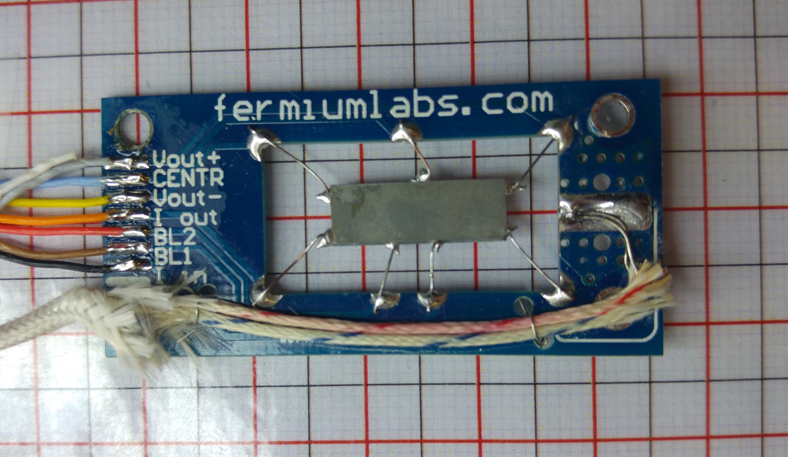
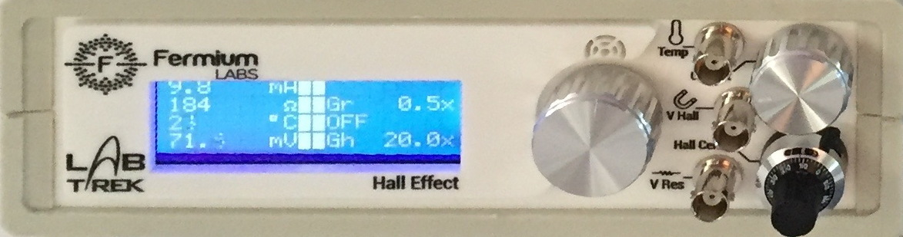

### The experimental setup

The apparatus uses a Ge sample, cut from a standard P-doped wafer, placed inside a isothermal aluminum case. It is placed in the gap between two poles of a permanent magnet, realized from two Nd-Fe-B magnets and a U shaped soft-steel core, acting like a torus.

The sample has 7 wires tin soldered in the positions shown in figure {@fig:sample_circuitry} and {@fig:sample_pcb}  as follows:

{#fig:sample_circuitry}
\ 

*   Contacts 1 and 4 are used to feed the bias current Ib produced by a constant current generator (figure {@fig:sample_circuitry}).
*   Contacts 7 and 5 are used to measure (through a differential amplifier, DA for short) the voltage across the sample, in a 4-wire resistance measurement. 
*   Contacts 2-3 and 6 are the output of the Hall voltage and fed to the a second DA. 

    Contact 6 is the reference point for the  Hall voltage and contacts 2 and 3 are used to set the balancing potentiometer P after having removed the sample from the magnetic field (the Hall voltage should be zero in absence of applied magnetic field). 
    *Three contacts* are needed for the Hall voltage because *two contacts cannot be precisely aligned.
    
{#fig:sample_pcb}
\ 

{#fig:frontPanel}
\ 

The DA outputs are amplified by Programmable Gain Amplifiers (PGA for short) whose outputs are referred to ground voltage in order to feed the signals to a data-logger. 

The numbering of the contact on the sample corresponds to the number of the pins in the rj45 connector of the sample assembly.

The two DAs have fixed gains $G$, set to $0.5$ for $V_{out \, R}$ and to $10$ for $V_{out \, H}$ [^GainMayChange], and they're powered from a $\pm 15V$ power supply. 

[^GainMayChange]: The gain can change due to specifications and calibration. Please refer to the values displayed on the front panel.

The PGA gains are selectable among the following values $G_{ PGA}= \{ 1,2,5,10,20,50,100,200\}$ through the front panel as shown in figure {@fig:frontPanel}. The gain values shown on the front panel are the product of DA and PGA gains for both channels.

The output voltages on the front panel are restrained in a number of cases:

*   If the input voltage is $V_{out} > \frac{30}{G}$ the  DA saturates.
*   If the output of the DA is not $0 < V_{out} < 5.1$ it is clamped down by a Schottky diode to prevent damage to the circuitry.
*   If the output voltage of a PGA is not $0 < V_{out} < 5$ the PGA saturates
* 	If the $I_b$  current is set to values smaller than 7 mA or greater than 25 mA a warning message appears  (“TOO LOW !”  or “TOO HIGH !” respectively), because the constant current generator does not work properly outside of this range. 

Saturation in any channel gives a warning message ("OVERLOAD") on the front panel.

The bias current $I_b$ is  is set by rotating the knob on the front panel, and its value is measured from the voltage drop across a $100 \Omega$ resistor, and displayed on the front panel.   

The best value for the bias current is a compromise between the need to obtain a large $V_H$ to make measurements precise reducing the SNR (Signal to Noise Ratio) and a low self-heating of the element due to the Joule effect: $V_R$ and $V_H$ signal are proportional to $I$ while the Joule self-heating is $P=RI^2$
