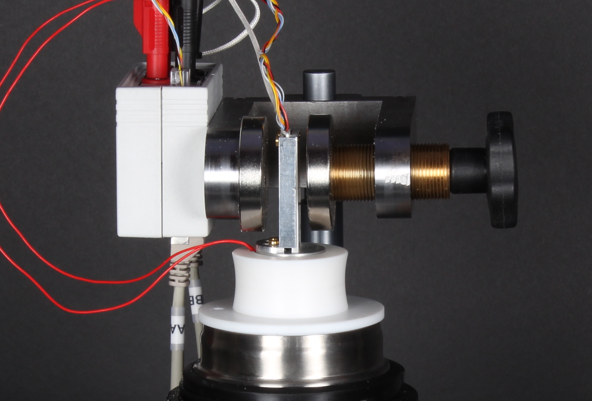

### Hall voltage and resistance measurements at room temperature

With a finite value of magnetic field B orthogonal to the large face of the sample, we should measure identical values for $V_H$ (but with opposite sign) when rotating of $180\,^{\circ}$ the sample.
This behavior must be tested before proceeding to further measurements: if reversing the $B$ direction (i.e. rotating the sample of $180\,^{\circ}$ degrees) different values are measured, the offsets should be better adjusted using potentiometer P in figure {@fig:sample_circuitry}.

The absolute value of $B$ may be varied by changing the width of the gap between the magnetic poles (see figure {@fig:ScrewDevice}).
One of the two permanent-magnets mounted on the soft-steel structure may be moved horizontally by turning the brass-screw: increasing the gap, the value of $B$ decreases.

{#fig:ScrewDevice}   
\ 

A calibration of the magnetic field $B$ as a function of the gap $d$ may be made using a gauss-meter probe placed between the poles (see fig. {@fig:BvsGapD})
