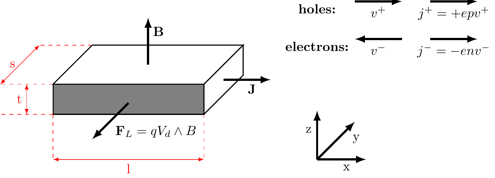
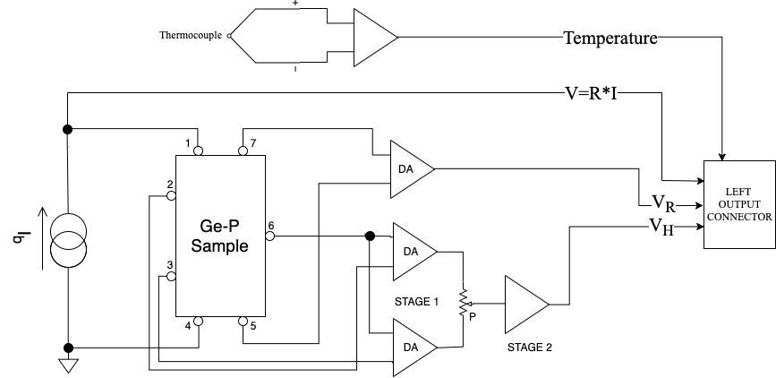
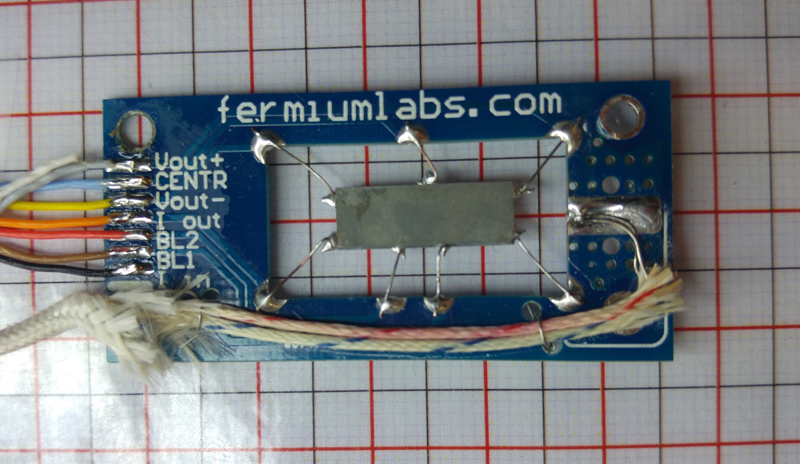
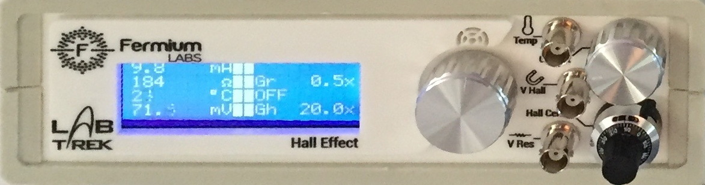
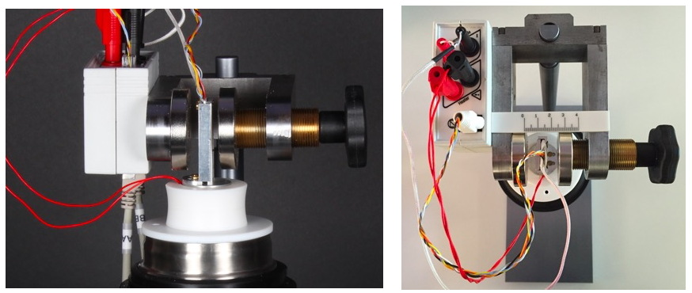
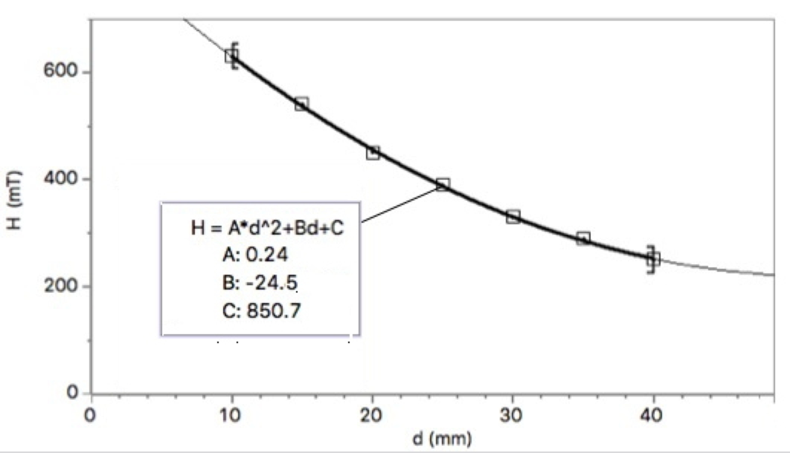
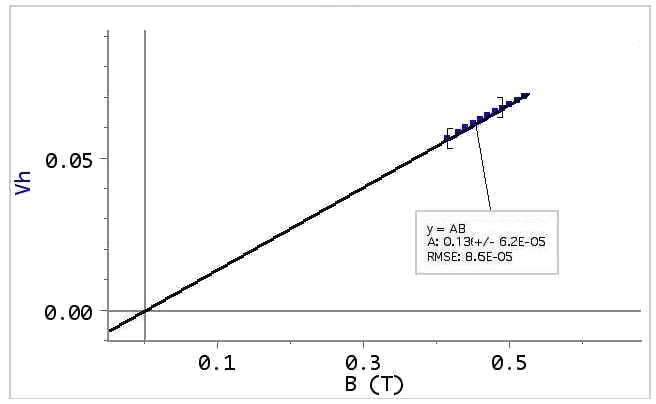
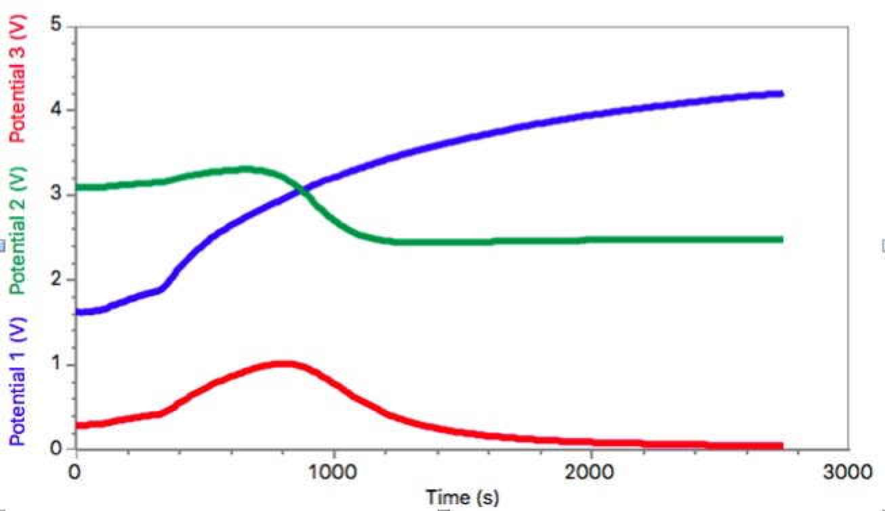
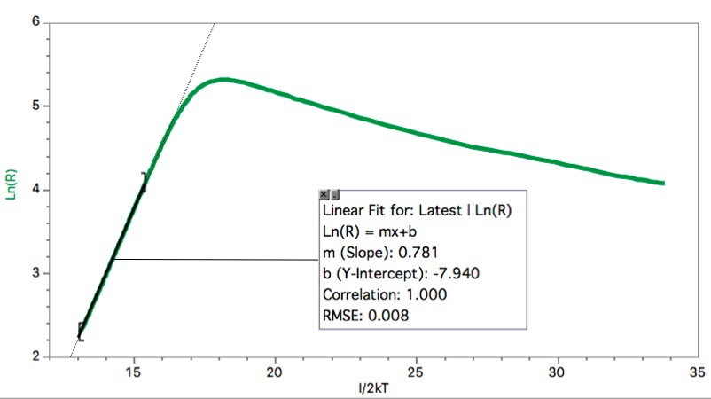
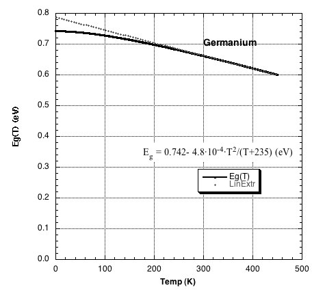

--- 
title: "Hall Effect Handbook"
author: "Prof. Giacomo Torzo"
date: "`r Sys.Date()`"
site: bookdown::bookdown_site
output: bookdown::gitbook
documentclass: book
biblio-style: apalike
link-citations: yes
---


<!--
Copyright (C)  2016  Labtrek srl & Fermium LABS srl.
Permission is granted to copy, distribute and/or modify this document under the terms of the GNU Free Documentation License, Version 1.3 or any later version published by the Free Software Foundation;
with the Invariant Sections being "Authorship", Front-Cover Texts, and one Back-Cover Text: "This manual was written by and for Labtrek srl and Fermium LABS srl".
A copy of the license is included in the section entitled "GNUFree Documentation License".
-->


<!--chapter:end:index.Rmd-->

\clearpage

# Introduction


Edwin Herbert Hall discovered the “Hall effect” in 1879 while working on his doctoral thesis in Physics investigating the influence of magnets on the resistance of a coil excited by a current. Hall discovered that a magnetic field would skew equipotential lines in a current-carrying conductor. This effect is observed as a voltage (Hall voltage) perpendicular to the direction of the current in the conductor.

The magnitude of this discovery is even more impressive considering how little was known about electricity in his time. The electron, for instance, was not identified until more than 10 years later.

The “Hall effect” remained a laboratory curiosity until the latter half of the XX century because the materials available, such as metals, would only produce small Hall voltages. With the advent of semiconductor technology and the development of various III-V compounds, it became possible to produce Hall voltages many orders of magnitude greater, allowing the production of Hall sensors, mostly made of indium antimonide ($\mathrm{InSb}$), indium arsenide ($\mathrm{InAs}$) and gallium arsenide ($\mathrm{GaAs}$).

<!--chapter:end:01-Hall_Handbook.Rmd-->

# A macroscopic approach to Ohm’s laws

The usual *macroscopic* approach to electrical conduction is based on the following experimental observations on metallic conductors:

1) The application of a steady voltage difference $V$ to a metallic wire produces a steady electric current $I$ proportional to $V$. This holds true at least for small values of $I$ when the temperature of the wire does not increase appreciably.

This allows the definition of the *electric resistance* as follows, according to the first Ohm's law:
 \begin{equation}
 R=\frac{ V }{ I }
 (\#eq:ohmLaw1)
 \end{equation}

2) For high currents the wire temperature increases and the power $W=VI$ supplied by the generator to the moving charges, instead of accelerating more and more the circulating charge, is converted into heat (Joule effect).

It could appear that the moving charges are subjected to some kind of force, like a body falling in a viscous medium, so that they reach a steady motion and give up part of their kinetic energy to the “body” of the wire (i.e. to the crystal lattice).

3) The resistance $R$ increases with increasing temperature.

4) Using wires of different length $l$ and sections $S$ the second Ohm's law determines the resistance:

\begin{equation}
R= \frac{ \rho l}{S} 
(\#eq:ohmLaw2)
\end{equation}

where the constant $\rho$ (the *electrical resistivity*) has a characteristic value for any material and increases with temperature.

The inverse quantity, the *electrical conductivity* $\sigma$, can be expressed using the two Ohm's laws as:

\begin{equation}
\sigma = \frac{1}{ \rho }=\frac{J}{E}
(\#eq:conductivity)
\end{equation}


where $J$ is the current density and $E$ the electric field intensity. This is the starting relation needed to pass to a *microscopic* picture, that will allow a better understanding of the phenomena.

<!--chapter:end:02-Hall_Handbook.Rmd-->

# A semiclassical microscopic model

The simplest microscopic model one can use is the “free electron gas" model of metals, in which the valence electrons are supposed to be practically free from their original atoms, and thus to move in the crystal lattice formed by the metal ions. In the absence of an applied electric field, the electron velocities are randomly distributed, with zero mean value and a *root mean square* value $v_{m}$ that may be evaluated from the equation:
\begin{equation}
\frac{1}{2}mv_{m}^2=\frac{3}{2}kT
(\#eq:electronVrms)
\end{equation}


where $k$ is the Boltzmann constant, $m$ the electron mass and $T$ the absolute temperature: at room temperature $v_{m}$ turns out to be of the order of $10^5 m/s$.

Only when an electric field is externally applied the electron motion acquires an ordered component with a *mean value* $v_d$ (the *drift velocity*) which turns out to be very small with respect to $v_{m}$ as we will show later.

The drift velocity, i.e. this ordered component of the motion due to the electric field and to the the scattering of the electrons with the lattice, is simply proportional to the electric field intensity. The constant ratio between $v_d$ and $E$ (both in modulus) is called the *drift mobility* $\mu$.

During a time $t$ of free motion between two collisions,the electrons subject to the force *qE* (*q* is the electron charge) increase their speed of the quantity:
\begin{equation}
a t = \frac{qE}{m}t
(\#eq:electronsDelta)
\end{equation}

The kinetic energy of the electrons also increases, but it can be assumed that with each collision they lose additional energy. The transfer of such energy to the lattice ions explains the Joule effect.

It can be noticed[^feynman] that, after the application of the electric field, the average speed of the electrons is not zero but instead:
\begin{equation}
v_d=a\tau=q\tau\frac{E}{m}
(\#eq:electronsAvgSpd)
\end{equation}

[^feynman]: See for instance *The Feynman lectures on Physics* vol.I 43-1,3 Addison-Wesley 1963.

obtained from \@ref(eq:electronsDelta) where $\tau$ is the mean free time between collisions [^meanFreeTimeBetweenCollisions], so that the drift mobility $\mu$ has the microscopic expression :

[^meanFreeTimeBetweenCollisions]: This time $\tau$ does not depend on the electric field because the average speed increment due to the applied electric field $V_d$ is very small with respect to the r.m.s. speed $V_m$ due to thermal motion .

\begin{equation}
\mu = \frac{v_d}{E} = \frac{q\tau}{m}
(\#eq:driftmobility)
\end{equation}

Using these concepts of drift speed and mobility the current density $J$ can be written as:

\begin{equation}
J = qn v_d
(\#eq:currentDensity)
\end{equation}

where $n$ is the free electron concentration and relation \@ref(eq:conductivity) and \@ref(eq:driftmobility) allow us to give a *microscopic definition* of the electrical conductivity:
\begin{equation}
 \sigma = q n \mu 
(\#eq:electricalConductivity)
\end{equation}

Relation \@ref(eq:electricalConductivity) tells us that all the physics of electrical conduction is described by the two parameters $n$ and $\mu$.

In the electron gas model $n$ should be, for a monovalent metal:
\begin{equation}
n=\frac{N_Am}{\delta}
(\#eq:nmonovalentmetal)
\end{equation}

where $N_A$ is Avogadro's number, $m$ is the atomic mass and $\delta$ the density. As an example $n=8.5 \cdot 10^{28}m^{-3}$ for copper. <!--maybe add a reference to https://en.wikipedia.org/wiki/Number_density-->
Of course here $n$ does not depend on the temperature, while drift mobility  decreases with increasing temperature[^drifmobilityAndTemperature] because of the increased thermal vibrations of the lattice ions. 


[^drifmobilityAndTemperature]: Drift mobility in semiconductors decreases with the absolute temperature $T$ as $T^{-\alpha }$, where $1.5<a<3.0$ depending on the prevailing type of interactions of the free carriers (with phonons, lattice defects, or impurities).


A rough order of magnitude for the electron mobility may be derived using \@ref(eq:driftmobility). A reasonable value for $\tau$ is: $\tau\approx\lambda/v_{m}$, where $\lambda$ is the electron mean free path, of the order of the interatomic distance in the metal (i.e. a few $\mathring{A}$) so that, at room temperature, $\tau$ is of the order of $10^{-15}s$.

Using the values of the elementary charge $e = 1.6 \cdot 10^{-19 }C$ and of the electron mass $9 \cdot 10^{-28} g$, the electron mobility $\mu=\frac{e\tau}{m}$ should be of the order of some $\frac{cm^2}{Vs}$.

Even for very large electric fields (up to $10^2 \frac{V}{cm}$) the drift velocity $v_d=\mu E$ is thus much smaller than $v_{m}$.


In order to check experimentally the microscopic model we must measure not only the electrical resistance (which gives the product of $n$ and $\mu$) but also the free charge density $n$: this can be obtained by performing a measurement of the Hall effect.

<!--chapter:end:03-Hall_Handbook.Rmd-->

# The Hall effect


The Hall effect is essentially due to the Lorentz force $\vec { F }$ acting on each electric charge $q$ moving with velocity $v$ in a magnetic field $B$.

\begin{equation}
\vec { F } =q\vec { V } \wedge \vec { B }
(\#eq:lorentzForce)
\end{equation}

Let us consider a conducting bar (Fig. \@ref(fig:hall-effect-geometry)) immersed into a uniform magnetic field $B$ directed along the $z$ axis, with an electric current $I_x$ flowing along the $x$ axis. The Lorentz force $F_L$ on moving charges, both positive and negative, acts in the direction shown by the arrow (Fig. \@ref(fig:hall-effect-geometry)) (independently from the charge sign).
```{r hall-effect-geometry, out.width='65%',fig.cap='Hall effect geometry',echo=FALSE,fig.align = 'center'}

```

In metals the electric current is only due to electrons. In semiconductors the charge carriers may be either electrons or holes.

In a pure semiconductor the electron density $n$ and the hole density $p$ is identical, in doped semiconductor we have $n\gg p$ (in N-doped material) or $p\gg n$ (in P-doped material). In doped semiconductors only one type of charge carriers is therefore important.

Let us consider first a metal or a N-doped semiconductor sample, where the relevant charge carriers are electrons.

In the electric field $E_x$ the electrons gain a drift velocity $v_d=–\mu E_x$ and they are subject to the Lorentz force $F_L=qv_dB$, pointing towards the negative $y$. While drifting in the $x$ direction they tend to crowd at the sample surface orthogonal to the $y$ axis and placed towards the reader in Fig. \@ref(fig:hall-effect-geometry).

This charge density increase at the sample lateral surface produces a difference of potential along the $y$ axis and therefore an electric field $E_H$. The value of the *Hall field* $E_H$ at equilibrium will correspond to an electric force $qE_H$ equal and opposite to the Lorentz force, i.e. $E_H=v_d B$. This relation tells us that the Hall field is proportional both to the current density (through $v_d$) and to the magnetic field. It is therefore convenient to define the Hall coefficient as:

\begin{equation}
R_H=\frac{E_H}{J_x B_z}
(\#eq:hallCoefficient)
\end{equation}

Recalling the relations $J_x=-env_d$ (or $J_x=+epv_d$) we get :


\begin{equation}
R_{ H }=V_{ d }\frac { B }{ J_{ x }B } =\frac { -1 }{ en } 
(\#eq:RHmn)
\end{equation}

or otherwise, for P-doped conductors:

\begin{equation}
 R_{ H }=\frac { +1 }{ ep }
(\#eq:RHp)
\end{equation}


Depending on the type of conductor, either metal \@ref(eq:hallCoefficient) , N-doped \@ref(eq:RHmn) or P-doped \@ref(eq:RHp).

Measuring $R_H$ we can determine the concentration $n$ of majority carriers and their sign (if we know the direction of the vectors $\vec { B } ,\vec { J } ,\vec { E_{ h } }$ ).

We can obtain relation \@ref(eq:RHmn) by assuming identical drift velocity for all charge carriers. This is an approximate relation, found in the literature: <!--FIX, source?-->

\begin{equation}
 R_H = \frac{r}{nq}
(\#eq:foundInLiterature)
\end{equation}


where $r$ is a parameter that accounts for the statistical velocity distribution of the charge carriers, as well as the different scattering mechanisms: $r\approx 1.2$ for mainly phonon scattering (lattice vibrations) and $r\approx 1.9$ for mainly impurity scattering. <!--FIX, mainly? sounds strange-->

The Hall coefficient in semiconductors is many order of magnitude larger than the one in metals, due to the smaller charge density. This makes easier to measure Hall voltages in semiconductors, where a bias current $I_x$ of a few $mA$ may conveniently generate a Hall voltage $V_H$ of in the order of a few $mV$.

To measure $R_H$ we must know $V_H$, $I_x$, $B$ and the sample thickness $t$:

\begin{equation}
 R_{ H }=\frac { E_{ h } }{ B{ J }_{ x } } =\frac { V_{ H } }{ s } =\frac { B{ I }_{ x } }{ ts } =\frac { V_{ h }t }{ B{ I }_{ x } } 
(\#eq:Rh)
\end{equation}


It is worth noting that the the Lorentz force direction does not depend on the charge sign.

The general expression for $R_H$, valid (see Appendix 1) <!-- FIX --> when *both electrons and holes* are present with densities $n$ and $p$ and mobility $\mu_e$ and $\mu_h$ is:

\begin{equation}
 R_{ H }=r\frac { p\mu ^{ 2 }_{ h }-n\mu ^{ 2 }_{ e } }{ e(p\mu _{ h }-n\mu _{ e })^{ 2 } } 
(\#eq:RhGeneralExpression)
\end{equation}

Which corresponds to the relations and \@ref(eq:RHmn) and \@ref(eq:RHp) for $p\gg n$ or $n\gg p$

When two types of charge carriers are present the electrical conductivity becomes:

\begin{equation}
\sigma =e(p \mu_h + n \mu_e)
(\#eq:electricalConductivity2Carriers)
\end{equation}


The product $R_H \sigma$, is named Hall mobility $\mu_H$ (note the capital index "$H$" that distinguish it from hole mobility $\mu_h$).

For a doped semiconductor the Hall mobility $\mu_H$ approximates the *majority carriers* drift mobility $\mu_{h,e}$:

\begin{equation}
\mu _{ H }=R_{ H }\sigma =r\frac { p \mu^2_h - n \mu^2_e }{p \mu_h + n \mu_e} \approx r \mu_{h,e} 
(\#eq:muApproximateDriftMobility)
\end{equation}


From relation \@ref(eq:RhGeneralExpression) we see that by increasing the temperature in a *P-doped sample*, generating many intrinsic[^4] carriers (i.e. electron-hole pairs), the Hall coefficient $R_H$ (which is positive at room temperature in the extrinsic region) tends to decrease, and it may even change sign. This is explained by the mobility ratio $b=\mu_e/\mu_h>1$. *Note that this does not happen with a* N*-doped sample*.

[^4]: *Intrinsic* term labels properties related to pure semiconductors or to doped semiconductors at hight temperature, where the thermally generated carriers density is much larger than the (*extrinsic*) carrier density due to the dopant.

From relation \@ref(eq:RhGeneralExpression) at the temperature where $R_H=0$ (“*inversion point*”) we get $nb^2=p$, with $p=N_a+N$ <!-- if it is avogadro number it should be N_A? --> and $n=N$ (where $N_a$ is the dopant density and $N$ is the thermally-generated charge density in the intrinsic zone).
Therefore $Nb^2= N_a+N$, or $N_a/N=b^2-1$.

The intrinsic conductivity *measured* at the inversion point is:

\begin{equation}
\sigma_{oi} = e(n \mu_e + p \mu_h ) = e[N( \mu_e + \mu_h)+ N_a \mu_h ] = e \mu_h [N(b+1)+N_a]
(\#eq:intrinsicConductivityInvPoint)
\end{equation}

In the extrinsic region of a P-doped sample, where the charge carrier density is constant $n=N_a$, the conductivity is proportional to the carrier mobility $\mu_h$: i.e. $\sigma_e(T) = eN_a \mu_h(T)$

The experimentally measured temperature dependence of the mobility is a power-law $\mu(T)=const( T^\alpha)$, where the exponent $\alpha$ (in the range $1.5<\alpha<3.0$) depends on the type of prevailing interaction of the charge carriers with phonons, lattice defects or impurities).

Therefore we may *extrapolate the extrinsic conductivity at the inversion point* $\sigma_{ei}$, and from the ratio ${\sigma_{oi}}/{\sigma_{ei}}$ we get the $b$ value:

\begin{equation}
\frac{\sigma_{oi}}{\sigma_{ei}} =e\mu_h \frac{N(b+1) + N_a}{e N_a \mu_h}= \frac{b}{b-1}
(\#eq:extrinsicConductivityInvPoint)
\end{equation}

which can as well be written as:

\begin{equation}
b=\frac{R_e}{R_e-R_o}
(\#eq:extrinsicConductivityInvPoint2)
\end{equation}


where $R_o$ is the measured sample resistance at the inversion point and $R_e$ is the resistance extrapolated from the extrinsic region (low temperature) to the value it would have at the inversion temperature.

The dopant concentration is related to the value of the *Hall constant at the inversion point* $R_{Ho}$ (in the extrinsic region only the hole concentration is significant) by the equations \@ref(eq:RHmn) and \@ref(eq:RHp), i.e. :

\begin{equation}
N_a \approx p \approx \frac{1}{e R_{Ho}}
(\#eq:HallConstantInvPointRelation)
\end{equation}

<!--chapter:end:04-Hall_Handbook.Rmd-->

# Experiment Procedure
## The experimental setup

The apparatus uses a Ge sample, cut from a standard P-doped wafer, placed inside a isothermal aluminum case. It is placed in the gap between two poles of a permanent magnet, realized from two Nd-Fe-B magnets and a U shaped soft-steel core, acting like a torus.

The sample has 7 wires tin soldered in the positions shown in Fig. \@ref(fig:sample-circuitry) and Fig. \@ref(fig:sample-pcb)  as follows:
```{r 'sample-circuitry', out.width='65%',fig.cap='Simplified schematic of the sample circuitry',echo=FALSE,fig.align = 'center'}

```


*   Contacts 1 and 4 are used to feed the bias current Ib produced by a constant current generator (Fig. \@ref(fig:sample-circuitry)).
*   Contacts 7 and 5 are used to measure (through a differential amplifier, DA for short) the voltage across the sample, in a 4-wire resistance measurement. 
*   Contacts 2-3 and 6 are the output of the Hall voltage and fed to the a second DA. 

    Contact 6 is the reference point for the  Hall voltage and contacts 2 and 3 are used to set the balancing potentiometer P after having removed the sample from the magnetic field (the Hall voltage should be zero in absence of applied magnetic field). 
    *Three contacts* are needed for the Hall voltage because *two contacts* cannot be precisely aligned.
   
```{r sample-pcb, out.width='65%',fig.cap='Printed circuit board with germanium sample and thermocuple',echo=FALSE,fig.align = 'center'}

```    


The DA outputs are amplified by Programmable Gain Amplifiers (PGA for short) whose outputs are referred to ground voltage in order to feed the signals to a data-logger. 

The numbering of the contact on the sample corresponds to the number of the pins in the rj45 connector of the sample assembly.

The two DAs have fixed gains $G$, set to $0.5$ for $V_{out \, R}$ and to $10$ for $V_{out \, H}$ [^GainMayChange], and they're powered from a $\pm 15V$ power supply. 


```{r frontPanel, out.width='65%',fig.cap='Device front panel',echo=FALSE,fig.align = 'center'}

``` 


[^GainMayChange]: The gain can change due to specifications and calibration. Please refer to the values displayed on the front panel.

The PGA gains are selectable among the following values $G_{ PGA}= \{ 1,2,5,10,20,50,100,200\}$ through the front panel as shown in Fig. \@ref(fig:frontPanel). The gain values shown on the front panel are the product of DA and PGA gains for both channels.

The output voltages on the front panel are restrained in a number of cases:

*   If the input voltage is $V_{out} > \frac{30}{G}$ the  DA saturates.
*   If the output of the DA is not $0 < V_{out} < 5.1$ it is clamped down by a Schottky diode to prevent damage to the circuitry.
*   If the output voltage of a PGA is not $0 < V_{out} < 5$ the PGA saturates
* 	If the $I_b$  current is set to values smaller than 7 mA or greater than 25 mA a warning message appears  (“TOO LOW !”  or “TOO HIGH !” respectively), because the constant current generator does not work properly outside of this range. 

Saturation in any channel gives a warning message ("OVERLOAD") on the front panel.

The bias current $I_b$ is  is set by rotating the knob on the front panel, and its value is measured from the voltage drop across a $100 \Omega$ resistor, and displayed on the front panel.   

The best value for the bias current is a compromise between the need to obtain a large $V_H$ to make measurements precise reducing the SNR (Signal to Noise Ratio) and a low self-heating of the element due to the Joule effect: $V_R$ and $V_H$ signal are proportional to $I$ while the Joule self-heating is $P=RI^2$

<!--chapter:end:05-Hall_Handbook.Rmd-->

## Hall voltage and resistance measurements at room temperature

With a finite value of magnetic field B orthogonal to the large face of the sample, we should measure identical values for $V_H$ (but with opposite sign) when rotating of $180\,^{\circ}$ the sample.
This behavior must be tested before proceeding to further measurements: if reversing the $B$ direction (i.e. rotating the sample of $180\,^{\circ}$ degrees) different values are measured, the offsets should be better adjusted using potentiometer P in Fig. \@ref(fig:sample-circuitry).

The absolute value of $B$ may be varied by changing the width of the gap between the magnetic poles (see Fig. \@ref(fig:ScrewDevice)).
One of the two permanent-magnets mounted on the soft-steel structure may be moved horizontally by turning the brass-screw: increasing the gap, the value of $B$ decreases.

```{r ScrewDevice, out.width='65%',fig.cap='The screw device for changing the effective magnetic field',echo=FALSE,fig.align = 'center'}

```


A calibration of the magnetic field $B$ as a function of the gap $d$ may be made using a gauss-meter probe placed between the poles (see Fig. \@ref(fig:BvsGapD))

<!--chapter:end:06-Hall_Handbook.Rmd-->

## The set-up for changing and measuring the sample temperature


The stainless-steel dewar can be filled of liquid nitrogen or a mixture of acetone and dry-ice (solid carbon dioxyde). The cold finger (the aluminum bar screwed into the base of the sample) is surrounded by the liquid nitrogen, allowing the sample to be cooled .

```{r seebeckNonlinearity, out.width='30%',fig.cap='The thermocouple sensitivity (the Seebeck coefficient) does strongly depend on temperature.',echo=FALSE,fig.align = 'center'}
knitr::include_graphics('Assets/Figures/seebeck_coefficient_vs_temperature.png')
```


The temperature is measured by a type K (Chromel-Alumel) thermocouple thermally coupled to the sample. The small voltage generated by the thermocouple is amplified by an AD8495[^AD8495] integrated circuit. The output (roughly proportional to the temperature with a sensitivity of $\approx 5\frac { mV }{ \,^{\circ}\mathrm{K} }$ is amplified by a non-inverting amplifier (not shown in picture) to get $\approx 10\frac { mV }{ \,^{\circ}\mathrm{K} }$ and shifted to obtain $V_{out \, T}=2.5V$ at $273.15\,^{\circ}\mathrm{K}=0\,^{\circ}\mathrm{C}$. While the K type thermocouple is fairly linear in a small range near room temperature, it is not linear in the whole temperature range covered by the apparatus, as can be seen in Fig. \@ref(fig:seebeckNonlinearity).

[^AD8495]: [AD8495 datasheet, Analog Semiconductors](http://www.analog.com/en/products/amplifiers/specialty-amplifiers/thermocouple-interface-amplifiers/AD8495.html)


In order to get a correct measurement it is necessary to compensate for the non-linearity (see Fig. \@ref(fig:seebeckNonlinearity)) of the thermocouple using the following polynomial:

\begin{equation}
t_{calc}=d_{ 0 }+d_{ 1 }E+d_{ 2 }E^{ 2 }+...+d_{ n }E^{ n }
(\#eq:compensatingPolynomial)
\end{equation}

where $E$ is the output voltage of the thermocouple in $mV$.

A fitting polynomial \@ref(eq:compensatingPolynomial) of the fifth order is sufficient, given the precision of our equipment.

The table \@ref(tab:kcoefftable) shows the polynomial coefficients obtained from a best fit of the NIST[^srdata] data tables.
```{r kcoefftable,echo=F}
knitr::kable(data.frame(Coefficient=c('$d_0$','$d_1$','$d_2$','$d_3$','$d_4$','$d_5$'),Value=c(0.3837,25.22,0.2795,0.07205,0.01409,0.001056)),booktabs = TRUE,caption = 'Polynomial coefficients obtained from NIST K thermocouple tables ($-200< t \\, [^{\\circ}\\mathrm{C}] <200$).')
```

[^srdata]: NIST t-90 tables for K type thermocouples, http://srdata.nist.gov/its90/download/type_k.tab

Fig. \@ref(fig:NISTfit) shows the NIST $t(E)$ data for K thermocouple compared with the results obtained using eq. 24 and the coefficient of table 1, and the residual errors in the range ($-200< t \, [^{\circ}\mathrm{C}] <200$)

```{r NISTfit, out.width='65%',fig.cap='Best fit curve for NIST data and residual errors',echo=FALSE,fig.align = 'center'}
knitr::include_graphics('Assets/Figures/NISTfit.png')
```


The voltage $E$ at the thermocouple junction can be obtained[^AD8495nist] from the following equation:

\begin{equation}
E=\frac { 1 }{ 2 } \frac {  V_{ outT }-{ V }_{ Ref }-{ V }_{ Offset } }{ Gain } 
(\#eq:voltageAtThermocoupleJunction)
\end{equation}


where $V_{outT}$ is the output of the instrument (on the front panel), $V_{Ref}=2.5V$ the voltage that indicates a temperature $T=0\,^{\circ}\mathrm{C}$, $V_{offset}$ is the error voltage at $0\,^{\circ}\mathrm{C}$ to achieve 125 mV at $25\,^{\circ}\mathrm{C}$ and $Gain$ is the internal gain of the AD8495 amplifier.

Using the fitting polynomial  \@ref(eq:compensatingPolynomial) allows us to finally obtain the  temperature in Celsius:

\begin{equation}
t={ f }_{ comp }\left( E \right)
(\#eq:FcompE)
\end{equation}

\begin{equation}
t={ f }_{ comp } \left( \frac { 1 }{ 2 } \frac { V_{ out }-2.5-1.25\cdot 10^{ -3 } }{ 122.4 } \right)
(\#eq:ad8494Compensated)
\end{equation}

[^AD8495nist]: [AN-1087, Analog Semiconductors](http://www.analog.com/Assets/Figures/en/technical-documentation/application-notes/AN-1087.PDF)


A digitally controlled resistive element (heater) is wound around the base of the sample, allowing to heath it up after reaching room temperature. The instruments automatically shuts down the heater if $t \ge 170\, \,^{\circ}\mathrm{C}$.

<!--chapter:end:07-Hall_Handbook.Rmd-->

\clearpage 

## Suggested procedure 

The display on the controller box shows the sample temperature in Celsius (calculated from the measured thermocouple signal), the measured bias current $I_b$ (mA), the sample resistance (calculated from the measured voltage drop across the sample) and the selected values of the $V_H$ and $V_R$ channels.

To obtain accurate measurements the best procedure is the following:


1. Connect the sample cables to the HUB and the HUB to the controller with the two ethernet cables (note: connect the controller port A with HUB port A ,and B with B). 
  
    Connect all the controller outputs (BNC ports) to your data-logger sensor inputs and choose an acquisition run with approximately $0.1Hz$ rate (i.e. 1 sample every 10 seconds) and duration at least 6000 seconds.
2. Choose a width for gap between the permanent magnets and measure the magnetic field B in the middle, using a gauss-meter. Place the sample far from the magnetic field and trim the balance-potentiometer to minimize the $V_H$ signal. Lock the potentiometer knob.
3. Place the sample in the middle of the gap. Choose a proper value for the current $I_b$ within the 7-25 mA allowed range, and select the proper gains for $V_H$ and $V_R$ channels. Note : the resistance at higher temperature may exceed the value at room temperature by a factor 2, and  also the VH signal increase with temperature. Therefore at room temperature your data-logger should read typically $V_{out \, H} <0.4V$ and $V_{out \, R}<2.5V$. 
4. Check that the $V_H$ value changes sign when rotating the sample of 180° around vertical axis. Choose the orientation that gives positive $V_H$.
5.  Prepare all the data conversion you think useful. For example : from $V_{out \, R}$ and the known $I_b$ and $G_R$ gain values obtain R(ohm), from $V_{out \, H}$ and $G_H$ gain values obtain $V_H$ (in $mV$), from $V_{out \, T}$ obtain the K-thermocouple e.m.f. E(mV) $[E=0.5 \cdot 1000 \cdot \frac{ (V_{out \, T}-2.5-0.00125)}{122.4}]$, from the calculated $E(mV)$ obtain the Celsius temperature $t$ using the fitting polynomial,...
6. Fill about half of the dewar with liquid nitrogen and wait until the liquid surface is quiet.
7. Prepare at least one graph with temperature vs time, and one with output signals vs time in your data-logger. 
    Insert the cold finger into the dewar (the PTFE dewar-cover should seat stable onto the dewar mouth, and the PTFE heater cover should be set with the hole hosting the pin protruding from the dewar-cover) as shown in Fig. \@ref(fig:ScrewDevice). Adjust the sample in the mid of the magnet-gap and start the data acquisition.
8. When the plot temperature vs time shows a slope close to zero, stop the data acquisition and save your data.
9. Empty the dewar (e.g. transferring the residual liquid nitrogen into another dewar), reposition the sample in the middle of the magnets-gap and start a new data acquisition for increasing temperature.
10. When the temperature vs. time slope start approaching zero, switch-ON the heater (Press the control knob 3 times, until the arrow reaches the OFF and turn the knob). 

To obtain precise measurements, at least one hour is required for the whole temperature sweep. 

Note: it is not suggested to keep liquid nitrogen inside the dewar while heating-up the sample: the temperature would rise more slowly and more humidity would condense onto the outer surface of the aluminum probe envelope. 

It is also useful to blow-off the frost in order to prevent water entering the probe envelope (this might affect the thermocouple signal).

<!--chapter:end:08-Hall_Handbook.Rmd-->

## Typical results

The sample shown in figure 3 (and used to obtain the data  in the following examples)  has thickness $t=0.5mm$, width $w=10mm$ and lenght $l=15mm$.

A calibration of the magnetic field intensity $B$ vs. gap $d$ between magnets is shown in Fig. \@ref(fig:BvsGapD). 

```{r BvsGapD, out.width='65%',fig.cap='Measured $B$ values vs gap width $d$',echo=FALSE,fig.align = 'center'}

```


An example of the measured $V_H$ vs. magnetic field $B$ at room temperature is shown in Fig. \@ref(fig:HallvsIb).

```{r HallvsIb, out.width='65%',fig.cap='Hall voltage versus magnetic field intensity $B$',echo=FALSE,fig.align = 'center'}

```


Fig. \@ref(fig:Output-voltages-versus-time) shows an example of the measured values of the 3 output signals vs temperature obtained with a constant bias current $I_B=10mA$ and in a 0.4 $T$ magnetic field, using Vernier-LabPro interface. The graph shows *Potential 1*  $= V_{out \, T}$, *Potential 2* $= V_{out \,H}$, *Potential 3* $= V_{out \, R}$. 


```{r Output-voltages-versus-time, out.width='65%',fig.cap='Output voltages versus time',echo=FALSE,fig.align = 'center'}

```


Fig. \@ref(fig:Example)  shows an example of calculated data obtained using LoggerPro software. 
The Hall voltage $V_{H}$ (in mV) is is obtained from $V_{outH}$ by subtracting the offset 2.5 V and by accounting for the used value of the channel-H gain (here GainH=10). The resistance $R$ is calculated from $V_{outR}$ by  accounting for the used value of the channel-R gain (here GainR=0.5)and the measured value of the bias current $Ib$ .

```{r Example, out.width='65%',fig.cap='Example of calculated data',echo=FALSE,fig.align = 'center'}
knitr::include_graphics('Assets/Figures/example.png')
```


In order to evaluate the Ge energy gap $E_g$, a plot of $ln(R)$ vs. $1/2kT$ was built, after calculating from the Celsius temperature $Tc$ the absolute temperature $T$ ($k$ is the Boltzmann constant $k = 8.617 \cdot 10^{-5}$.

From the slope in the intrinsic region (high temperature region, see Fig. \@ref(fig:EgFit) ) we get the value of the energy gap $E_g$, extrapolated linearly to $T=0^{\circ}\mathrm{K}$, that can be compared to the known value for germanium ($E_g^o=0.78$, see Appendix 3)


```{r EgFit, out.width='65%',fig.cap='Example of linear best fit in the intrinsic region (high temperature)',echo=FALSE,fig.align = 'center'}

```

<!--chapter:end:09-Hall_Handbook.Rmd-->

# Appendix 1: Use of the optional Extension HUB

An optional Extension HUB (ExtHUB)is provided with the device. This allows the user to measure the voltages (with respect to the ground or as differential voltages) at the 7 contacts on the Ge sample, by using an high impedance multimeter. 

The ExtHUB must be connected between the sample and the fixed HUB (FixHUB) placed on the magnet holder using the black cable with rj45 plugs. Note: do not unplug the cable from the ExtHUB; the cable should be connected to the FixHUB and the sample cable should be connected to the ExtHUB (see Fig. \@ref(fig:ExtensionHUB)). 


```{r ExtensionHUB, out.width='40%',fig.cap='The Extension HUB connections',echo=FALSE,fig.align = 'center'}
knitr::include_graphics('Assets/Figures/imageExtensionHub.jpg')
```


  
For example a two-wire resistance measurement between the Test Points (TP) 1-4, 1-5, 7-4 or 7-5 will give a value larger than the real resistance measured by the 4-contacts method, and displayed on the front panel. 

Note: be sure to switch-off the controller while taking measurements with the ExtHUB !

<!--chapter:end:10-Hall_Handbook.Rmd-->

# Appendix 2: calculation of $R_H$ for small and high magnetic field

The motion equation $(F=ma)$ for charge carriers can as well be written as:

\begin{equation}
m(\frac{dv}{dt}+\frac{v}{\tau}) = qE+ q\vec{v} \wedge \vec{B} 
(\#eq:MotionEquationForChargeCarriers)
\end{equation}

where the charge $q$ is the $\pm e$ for holes and electrons and we account for the mean time $\tau$ between collisions and for the Lorentz force.
In stationary conditions the acceleration is zero. Therefore the velocities along $x$ ($B$ is directed along $z$) for electrons and holes are respectively:

\begin{equation}
V_{ex}=-\frac{e\tau}{m}E_x+\frac{e\tau}{m}\vec{v}\wedge\vec{B}=-\mu_e v_{e\, y}B
(\#eq:XvelocitiesForElectrons)
\end{equation}

\begin{equation}
V_{hx}=\mu_h E_x+\mu_h v_{e\, x}B
(\#eq:XvelocitiesForHoles)
\end{equation}

And, for velocities along y:

\begin{equation}
V_{ e \, y} = -\mu_e E_y- \mu_e V_{e \, x} B
(\#eq:YvelocitiesForElectrons)
\end{equation}


\begin{equation}
V_{h \, y} = \mu_h E_y + \mu_h v_{h \, x}B
(\#eq:YvelocitiesForHoles)
\end{equation}


The current density along the <!-- is it the x AXIS or x in some other way? -->$x$ axis $(J = e V_{h \, x} P - eV_{e \quad x} n)$ can as well be written as:


\begin{equation}
J_x \approx e(p \mu_h + n \mu_e)E_x + e(p \mu_h v \mu_{h \, y} - n \mu_e v_{e \, y})B \approx \\
\approx e ( p \mu_h + n \mu_e) E_x + e (p \mu_h^2 -n \mu_e^2 )BE_y
(\#eq:currentDensityAlongX)
\end{equation}


where we made the approximation $v_y \approx \mu_y E_y$, neglecting here the Lorentz force.
Recalling that $E_y \ll E_x$, for small magnetic fields $B$ \@ref(eq:currentDensityAlongX) may be approximated by:

\begin{equation}
J_x \approx e(p \mu_h + n \mu_e) E_x
(\#eq:currentDensityAlongXaproxymated)
\end{equation}

For negligible current density along y we have:

\begin{equation}
J_y = e p v_{h \, y} - env_{e \, y} = 0
(\#eq:currentDensityAlongYNegligible)
\end{equation}

or using $v_{h \, x}$ and $V_{e \, x}$ definitions:

$$J_y = ep ( \mu_h E_y + \mu_h v_{h \, x} B) - en( -\mu_e E_y - \mu_e v_{e \, x}B) = 0$$

$$e(p \mu_h + n \mu_e) E_y + e(p \mu_h v_{h \, x} + n \mu_e v_{e \, x}) B = 0$$

$$E_y = B \frac {p \mu_h v_{h \, x} + n \mu_e v_{e \, x}}{p \mu_h + n \mu_e}$$

If again we assume $v_x \approx \mu_xE_x$ (neglecting, for small B, the correction for the Lorentz force <!-- is it the lorentz force ? --> we can write:

$$E_y \approx B \frac{p \mu^2_h - n \mu^2_e}{p \mu_h + n \mu_e} E_x$$

In this way the Hall coefficient becomes:

\begin{equation}
R_H = - \frac{E_y}{J_x B_z} \approx \frac {p \mu^2_h - n \mu_e^2}{e (p \mu_h + n \mu_e )^2}
(\#eq:hallCoefficientBecomes)
\end{equation}


The formula \@ref(eq:hallCoefficientBecomes) holds true only for *small values* of $B$.
For large $B$ values we must use \@ref(eq:hallCoefficientBecomes) for $J_x$ the definition \@ref(eq:currentDensityAlongX) instead of \@ref(eq:currentDensityAlongXaproxymated), obtaining for the Hall coefficient $R_H$:


\begin{equation}
R_{ H }(B)=\frac { E_{ y } }{ BJ_{ x } } \approx \frac { \left[ B\frac { (p\mu ^{ 2 }_{ h }-n\mu ^{ 2 }_{ e }) }{ (p\mu _{ h }+n\mu _{ e }) } E_{ x } \right] }{ Be\left[ (p\mu _{ h }+n\mu _{ e })+B^{ 2 }\frac { (p\mu ^{ 2 }_{ h }-n\mu ^{ 2 }_{ e })^{ 2 } }{ (p\mu _{ h }+n\mu _{ e }) } \right] { E }_{ x } } = \\
=\frac { (p\mu ^{ 2 }_{ h }-n\mu ^{ 2 }_{ e }) }{ e(p\mu _{ h }+n\mu _{ e })^{ 2 }\left[ 1+B^{ 2 }\frac { (p{ \mu }_{ h }^{ 2 }-n\mu ^{ 2 }_{ e })^{ 2 } }{ (p\mu _{ h }+n\mu _{ e })^{ 2 } } \right] } =\frac { R_{ H(B=0) } }{ 1+KB^{ 2 } }
(\#eq:HallCoefficientBigEquation)
\end{equation}

<!-- yeah i know that was long... -->
which tends to saturate at high B values.

<!--chapter:end:11-Hall_Handbook.Rmd-->

\clearpage

# Appendix 3: Temperature dependence of $E_g$

Experimental results consistently shows that the energy gap depends on temperature and for Germanium we can find in the literature the following empirical law:

\begin{equation}
E_{ g }(T)=0.742-\frac { 4.8\cdot 10^{ -4 }T^{ 2 } }{ T+235 } \quad \quad [eV]
(\#eq:eGempiricalLaw)
\end{equation}


This may be approximated, in the high temperature region, by a linear law
as follows:

$$E_g (T) = A \cdot BT$$

where the constants $A$ is the value of $E_g$ *linearly extrapolated* to $T=0$:
$$E^0_g = A = 0.78eV$$

Since in the intrinsic region (high temperature) the resistance depends on the absolute temperature $T$ as $exp( \frac{E_G}{2kT})$, a plot of $ln( R )$ vs $\frac{1}{2 K T}$ using a linear approximation for $E_g(T)$ results in a straight line with slope $E^0_g$

```{r EgTdependance, out.width='65%',fig.cap='Temperature dependance of the energy gap',echo=FALSE,fig.align = 'center'}

```

<!--chapter:end:12-Hall_Handbook.Rmd-->


<!-- ##Appendix 4: Data analysis using open-source R-Studio software

*This appendix is being written.* -->

<!--chapter:end:13-Hall_Handbook.Rmd-->

\clearpage

# Warnings

**Using high magnetic field require some caution:**

* You must avoid approaching any magnetizable object (clocks, electronic devices, screwdrivers...), which when brought too close may be permanently magnetized.

* A pinch hazard subsists if steel or other ferromagnetic material gets close to the magnets.

* Do not attempt to unscrew the magnets.

* The Magnets are brittle. A rapid shock with another magnet or ferromagnetic material may release shards dangerous for the eye.

* The apparatus **MUST NOT** be used by people with pacemakers.

\clearpage

# References

* J.C. Slater *Quantum Theory of matter*, mcGraw-Hill 1951.
* C.L.Chin e C.R.Westgate, *The Hall Effect and Its Applications*, Plenum Press, NY, 1979
* J.R.Hook, H.E.Hall *Solid State Physics*, John Wiley &Sons 1991.
* A. C. Melissinos *Experiments in modern Physics*, Academic Press, 1993.
* *New Semiconductor materials. Characteristics and Properties*, 
    \newline http://www.ioffe.ru/SVA/NSM/Semicond/Ge/index.html (Electronic archive)
* *The Semiconductor informations WebSite* (properties of Germanium), 
    \newline http://www.semiconductors.co.uk/propiviv5431.htm

# Authorship
This Handbook was originally written by Giacomo Torzo of [Labtrek](http://labtrek.it)

Integrations by Davide Bortolami and
Statistical analysis by Simone Tosato of [Fermium LABS](http://fermiumlabs.com)

## Revision history
For a complete revision history, check out the [Github repository](https://github.com/fermiumlabs/Hall-effect-apparatus/commits/master).

The last version of this document can be downloaded at [frm.li/hallhandbookmaster](https://frm.li/hallhandbookmaster) or with the following QR code:

{width=40%}

<!--chapter:end:14-Hall_Handbook.Rmd-->

